# **Pedido de Compra**

***```
Menu: Compras -> Pedido de Compra
```***

---

O **==Pedido de Compra==** é criado quando se tem a necessidade de comprar algo, sabendo-se fornecedor, quantidade, data da entrega e 
preço dos itens desejados. Ele pode ser criado manualmente no **B1Food** ou vir do *SAP Business One*, provenientes de **Solicitações 
de Compras** que foram criadas no B1Food.

Na tela inicial do **==Pedido de Compra==** é possível consultar todas que já foram criadas e qual o **Status** de cada uma delas.

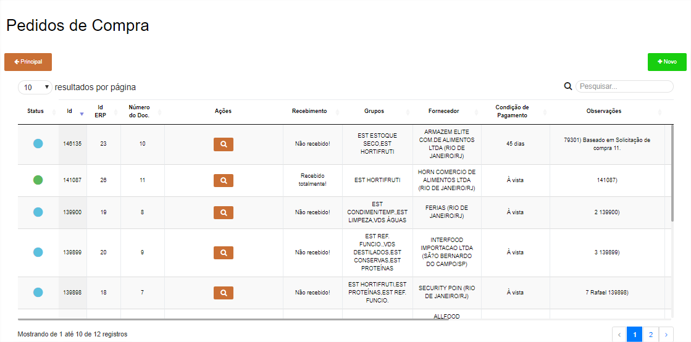

!!! Legenda

	=== "Status"
		**:fontawesome-solid-circle:{ .laranja } - Aguardando envio**: Esse **Status** quer dizer que o **==Pedido de Compra==** está aguardando para ser enviada à fila de integração com *SAP Business One*.

		**:fontawesome-solid-circle:{ .preto } - Aguardando integração**: Esse **Status** quer dizer que o **==Pedido de Compra==** está na fila de integração no *SAP Business One*.

		**:fontawesome-solid-circle:{ .azul_status } - Pedido em Andamento**: Esse **Status** quer dizer que o **==Pedido de Compra==** entrou no *SAP Business One* e está aguardando a criação de um Recebimento de Mercadoria a partir desse **==Pedido de Compra==** .

		**:fontawesome-solid-circle:{ .verde } - Pedido Finalizado**: Esse **Status** quer dizer que foi criado um Recebimento de Mercadoria a partir desse **==Pedido de Compra==**.

		**:fontawesome-solid-circle:{ .verde_forte } - Pedido recebido parcialmente**: Esse **Status** quer dizer que foi criado um Recebimento de Mercadoria a partir desse **==Pedido de Compra==**, mas não foi vinculado todos os itens do **==Pedido de Compra==** no Recebimento de Mercadoria.

		**:fontawesome-solid-circle:{ .vermelho } - Erro**: Esse **Status** quer dizer que o *SAP Business One* gerou algum erro, para saber qual é basta posicionar o cursor em cima do **Status**.

Para conseguir criar uma nova, basta clicar em **Novo** e na próxima tela é necessário informar quando precisa dos produtos e quais produtos/quantidades são necessários.

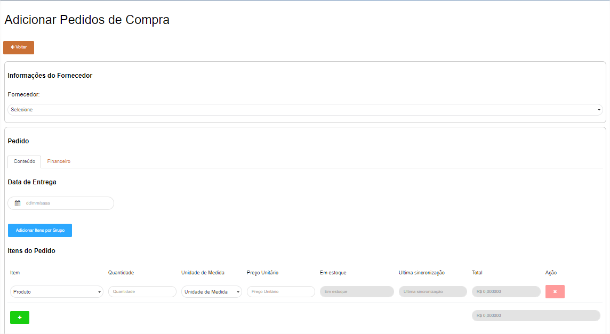

Segue as informações dos campos:

=== "Cabeçalho"

	*	**Fornecedor**: Informar o fornecedor que está fazendo o pedido de compra.
	*	**Data de Entrega**: Informar a data que o fornecedor irá entregar os produtos.

=== "Linhas"

	*	**Item**: Informar o item que deseja pedir.
	*	**Quantidade**: Informar a quantidade necessária (lembrando da conversão de medida).
	*	**Unidade de Medida**: Informar a unidade de medida (Conversão de Caixa 12 UN (CX12UN).
	*	**Preço Unitário**: Informar o preço unitário do item conforme acordado com fornecedor.
	*	**Em Estoque**: Se estiver com a configuração marcada, irá aparecer esse campo informando a quantidade desse item no estoque.
	*	**Última sincronização**: Se estiver com a configuração marcada, irá aparecer quando foi feito a consulta do estoque no *SAP Business One*.
	*	**Sub Total**: Cálculo entre Quantidade multiplicando pelo Preço Unitário.
	*	**Ação**: Excluir a linha.

=== "Financeiro"

	*	**Condição de Pagamento**: Informar a condição de pagamento acordado para esse pedido.


Para finalizar o **==Pedido de Compra==** é possível informar uma **Observação** para detalhar alguma informação e depois disso basta clicar em **Salvar**.

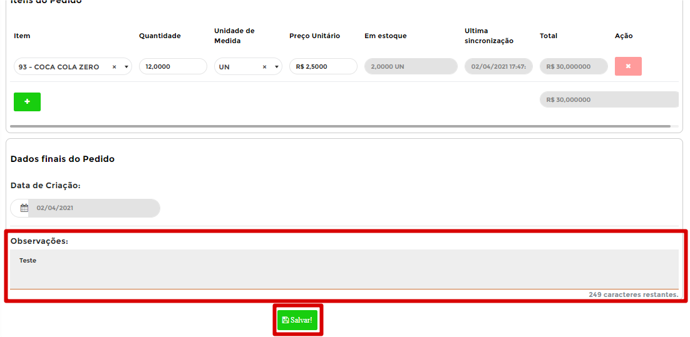

Pode acontecer de esquecer de preencher algum campo, com isso o B1Food irá apresentar uma mensagem de erro, segue exemplo:

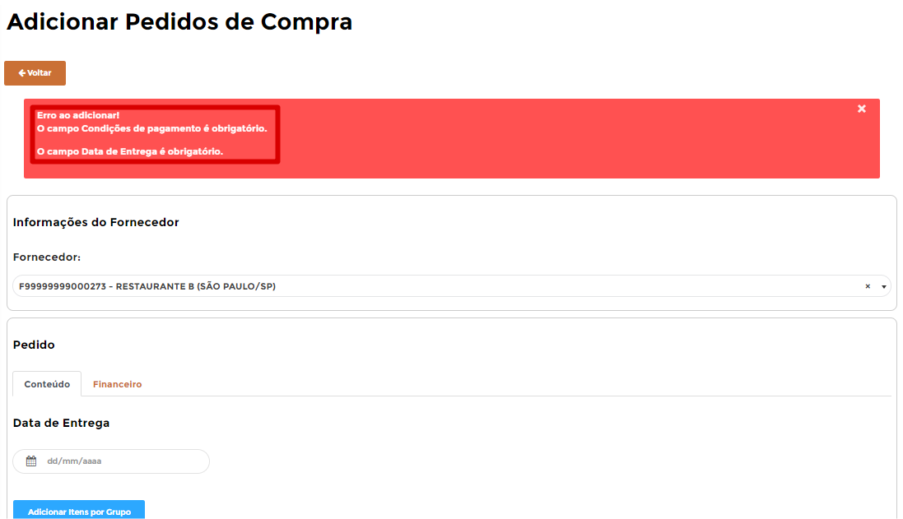

Caso o **==Pedido de Compra==** estiver certo irá aparecer uma mensagem de **Registro adicionado com sucesso** e será necessário clicar no botão **Voltar** para ir à página inicial do **==Pedido de Compra==**.

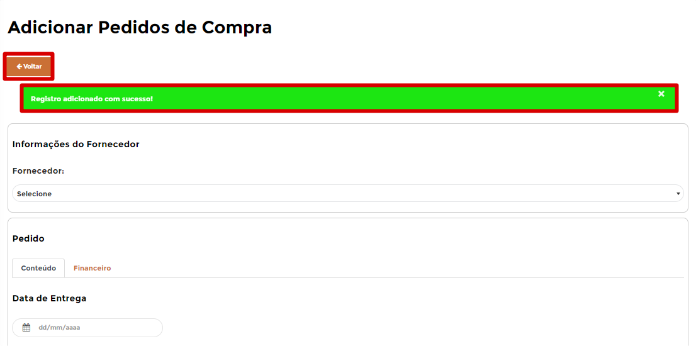

Será listado o **==Pedido de Compra==** que acabou de criar e com isso será listado 4 ações para esse **==Pedido de Compra==**, segue abaixo explicativo de cada uma delas.

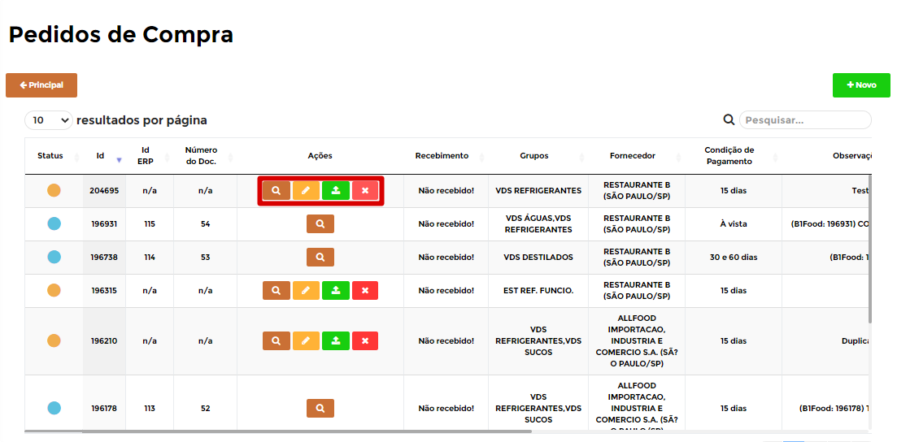

=== ":fontawesome-solid-search:{ .search }"
	*	A ação **Visualizar** irá abrir o **==Pedido de Compra==** para poder avaliar algum item, por exemplo. 
	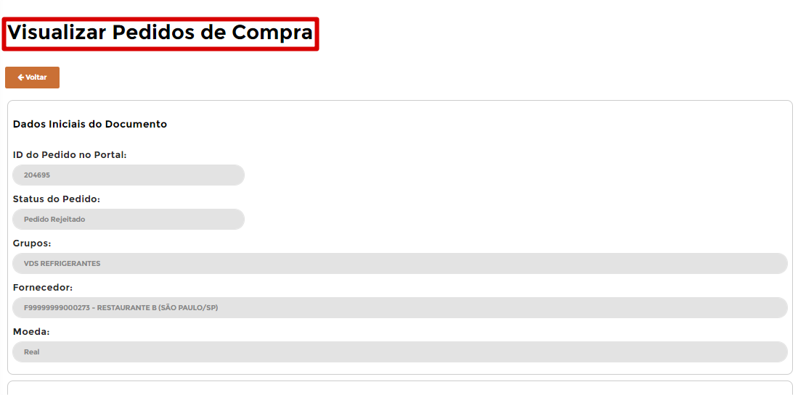{ align=left }

=== ":fontawesome-solid-pen-square:{ .pen }"
	*	A ação **Editar** irá abrir o **==Pedido de Compra==** para realizar alguma edição.
	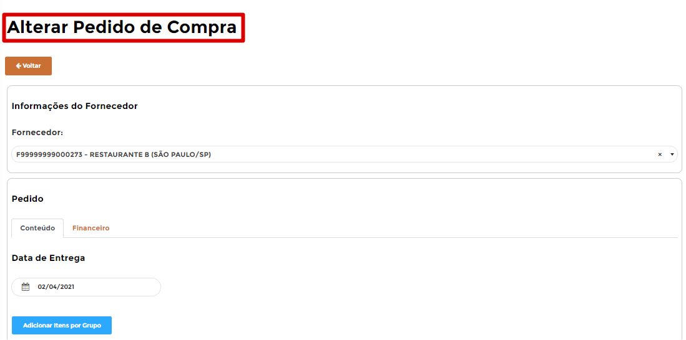{ align=left }

=== ":fontawesome-solid-check-square:{ .check }"
	*	A ação **Enviar** irá enviar para o *SAP Business One* a criação desse **==Pedido de Compra==**.
	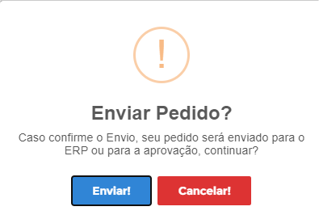{ align=left }

=== ":fontawesome-solid-window-close:{ .close }"
	*	A ação **Excluir** irá apagar o **==Pedido de Compra==** criado.
	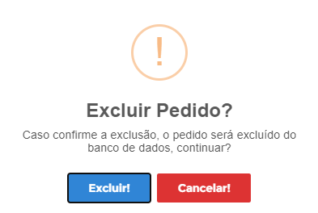{ align=left }

Se você enviou o **==Pedido de Compra==**, **depende da configuração** do seu B1Food ele pode ter ido direto para integrar com o *SAP Business One* ou ele pode ter entrado na **aprovação**, pode ser que você que faça ela ou outro usuário, mas irei explicar como realizar essa aprovação.

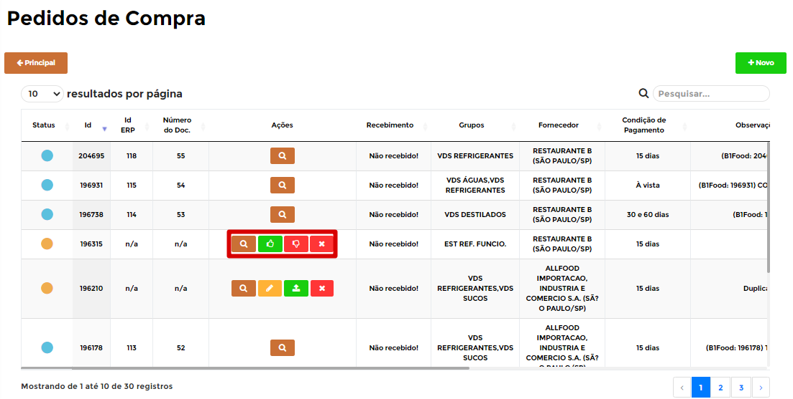

=== ":fontawesome-solid-thumbs-up:{ .aprovar }"
	*	A ação **Aprovar** irá enviar para o *SAP Business One* a criação desse **==Pedido de Compra==**.
	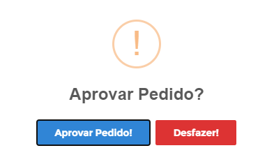{ align=left }

=== ":fontawesome-solid-thumbs-down:{ .rejeitar }"
	*	A ação **Rejeitar** será necessário informar o **Motivo** que rejeitou, para que o usuário que fez saiba e consiga realizar as devidas alterações para reenviar novamente.
	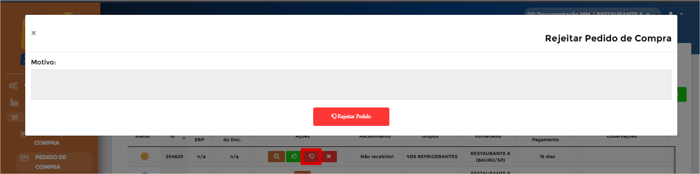{ align=left }

Caso o **==Pedido de Compra==** for aprovado, ele irá entrar para fila de envio para o *SAP Business One*, durante esse processo o **Status** ficará :fontawesome-solid-circle:{ .preto }, caso der tudo certo o **Status** irá ficar :fontawesome-solid-circle:{ .azul_status } e se der algum erro ao integrar com o *SAP Business One* o **Status** irá ficar :fontawesome-solid-circle:{ .vermelho } e irá apresentar o erro.