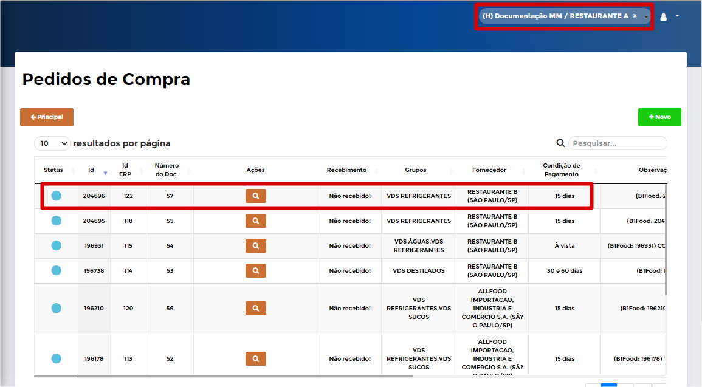

# **Pedido de Venda**

***```
Menu: Compras -> Pedido de Venda
```***

---

O **==Pedido de Venda==** é criado automaticamente (depende da sua **configuração**) quando uma filial realiza um Pedido de Compra para outra filial (Quando existe um Fornecedor com o mesmo CNPJ de umas das filiais configuradas no B1Food).

Na tela inicial do **==Pedido de Venda==** é possível consultar todas que já foram criadas e qual o **Status** de cada uma delas.


!!! Legenda

	=== "Status"

		**:fontawesome-solid-circle:{ .preto } - Aguardando integração**: Esse **Status** quer dizer que o **==Pedido de Venda==** está na fila para integração no *SAP Business One*.

		**:fontawesome-solid-circle:{ .azul_status } - Pedido Integrado**: Esse **Status** quer dizer que o **==Pedido de Venda==** entrou no *SAP Business One*.

Vamos de exemplo: Foi criado um **Pedido de Compra** na Filial **RESTAURANTE A** e o fornecedor informado foi o **RESTAURANTE B** (outra filial do B1Food), segue abaixo.



Portanto, após o **B1Food** criar o **Pedido de Compra** automaticamente ele irá criar o Pedido de Venda invertido, como se a Filial **RESTAURANTE B** tivesse realizado uma venda para o **RESTAURANTE A**, segue abaixo.


Lembrando que esse processo só é realizado caso a **configuração estiver ativa**. Caso exista um processo de compras entre filiais e você não utiliza essa função, **solicita isso ao Suporte da ManyMinds**.