# **Recebimento de Mercadoria**

***```
Menu: Compras -> Recebimento de Mercadoria
```***

---

O ==**Recebimento de Mercadoria**== é o processo de receber a mercadoria na loja, onde pode ser feito através de um pedido 
de compra ou um recebimento manual.

Na tela inicial da ==**Recebimento de Mercadoria**== é possível ver todas que já foram criadas e qual o **Status** de cada uma delas.

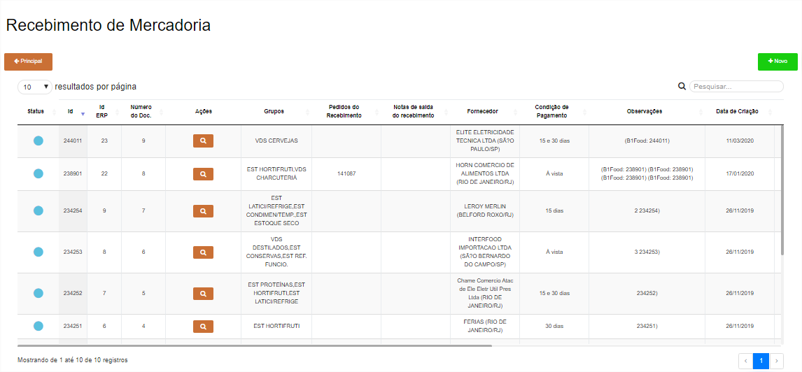

!!! Legenda

	=== "Status"
		**:fontawesome-solid-circle:{ .preto } - Recebimento aguardando confirmação do ERP**: Esse **Status** quer dizer que o **==Recebimento de Mercadoria==** está na fila para integração no *SAP Business One*.

		**:fontawesome-solid-circle:{ .verde } - Recebimento recebido pelo ERP**: Esse **Status** quer dizer que foi criado o **==Recebimento de Mercadoria==** no *SAP Business One*.

		**:fontawesome-solid-circle:{ .vermelho } - Erro**: Esse **Status** quer dizer que o *SAP Business One* gerou algum erro, para saber qual é basta posicionar o cursor em cima do **Status**.


## **Manual**

Ao clicar em **Novo**, existem várias opções e a primeira é ==**Recebimento de Mercadoria - Manual**== onde irá receber uma mercadoria sem documento base.

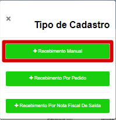

Ao escolher ==**Recebimento de Mercadoria - Manual**==, será necessário informar alguns campos.

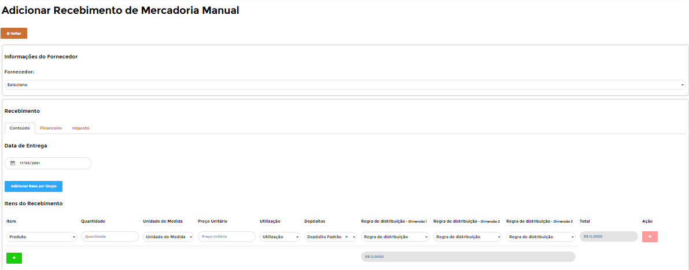

Segue as informações dos campos:

=== "Cabeçalho"

    *	**Fornecedor**:  Informar o fornecedor que está fazendo o Recebimento de Mercadoria.

=== "Conteúdo"

    *	**Data de Entrega**:  Informar a data que o fornecedor entregou os produtos.

=== "Linhas"

	*	**Item**: Informar o item que deseja pedir.
	*	**Quantidade**: Informar a quantidade necessária (lembrando da conversão de medida).
	*	**Unidade de Medida**: Informar a unidade de medida (Conversão de Caixa 12 UN (CX12UN).
	*	**Preço Unitário**: Informar o preço unitário do item conforme acordado com fornecedor.
	*	**Utilização**: Informar o motivo dessa compra (Insumo, revenda, insumo, despesa ou depende do processo definido).
	*	**Depósito**: Informar qual o depósito da filial que irá entrar o estoque.
	*	**Regras de distribuição**: Informar os centros de custos liberado para seu acesso, se tiver 3 dimensões liberadas, terá 3 campos de regras de distribuição.
	*	**Total**: Cálculo entre Quantidade multiplicando pelo Preço Unitário.
	*	**Ação**: Excluir a linha.

Após preencher a aba **Conteúdo**, é necessário preencher a aba **Financeiro**, informando a condição de pagamentos do documento que está inserindo, a ideia é essa informação auxiliar nas previsões de pagamentos.

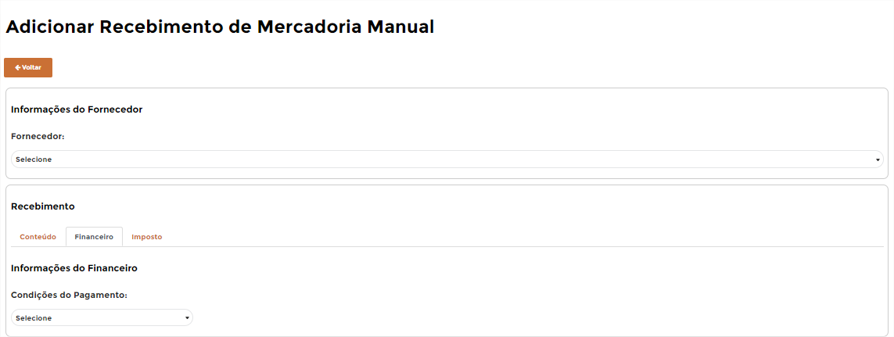

Segue as informações dos campos:

=== "Financeiro"

	*	**Condições de Pagamento**: Informar a condição de pagamento dessa Nota Fiscal.

Por último é necessário informar o número da nota fiscal, caso for um documento fiscal, mas se não for é necessário informar um número sequencial (recomendamos DDMMAAA (01012021)).

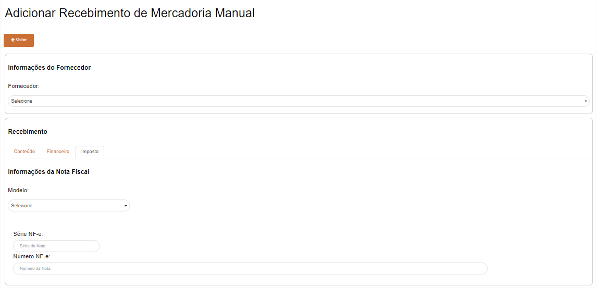

Segue as informações dos campos:

=== "Imposto"

	*	**Modelo**: Selecionar o EXTR (Externo).
	*	**Série NF-e**: Informar a série da NF-e.
	*	**Número NF-e**: Informar o número da NF-e.

Caso o **==Recebimento de Mercadoria - Manual==** estiver certo irá aparecer uma mensagem de **Registro adicionado com sucesso** e será necessário clicar no botão **Voltar** ir à página inicial do **==Recebimento de Mercadoria==**.

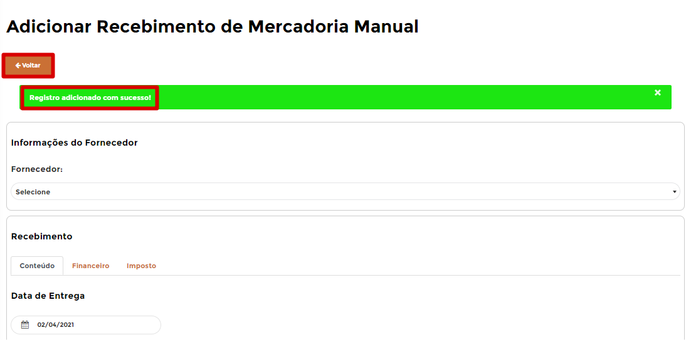

O **==Recebimento de Mercadoria - Manual==** irá entrar para fila de envio para o *SAP Business One*, durante esse processo o **Status** ficará :fontawesome-solid-circle:{ .preto }, caso der tudo certo o **Status** irá ficar :fontawesome-solid-circle:{ .verde } e se der algum erro ao integrar com o *SAP Business One* o **Status** irá ficar :fontawesome-solid-circle:{ .vermelho } e irá apresentar o erro.

---

## **Recebimento por Pedido**

A outra opção é **==Recebimento de Mercadoria - Pedido==**, onde será possível selecionar 1 ou mais pedidos (se for do mesmo fornecedor) para realizar o recebimento.

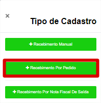

Após escolher essa opção, será necessário escolher um ou mais pedidos (sempre do mesmo fornecedor) e depois selecionar “Novo Recebimento”.

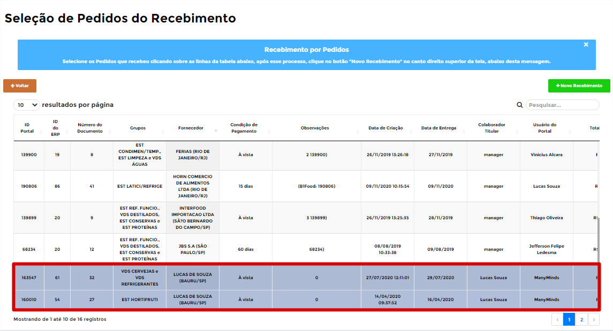

O B1Food irá carregar todas as informações dos pedidos escolhidos, será necessário preencher a data que chegou a mercadoria e os demais 
campos nas linhas que precisam ser validados e preenchidos.

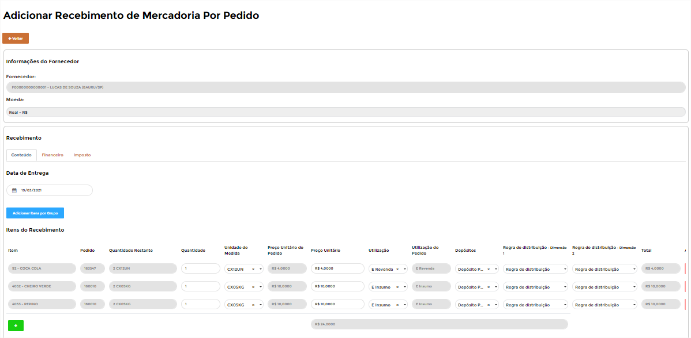

Segue as informações dos campos:

=== "Conteúdo"

	*	**Data de Entrega**:  Informar a data que o fornecedor entregou os produtos.

=== "Linhas"

	*	**Item**: B1Food irá trazer o item dos pedidos selecionados.
	*	**Quantidade**: B1Food irá trazer a quantidade dos pedidos selecionados, mas é possível realizar edição, para ser informado a real quantidade.
	*	**Unidade de Medida**: Informar a unidade de medida (Conversão de Caixa 12 UN (CX12UN).
	*	**Preço Unitário do Pedido**: B1Food irá trazer o preço unitário dos pedidos selecionados.
	*	**Preço Unitário**: Informar o preço unitário do item conforme documento recebimento.
	*	**Utilização**: Informar o motivo dessa compra (Insumo, revenda, insumo, despesa ou depende do processo definido).
	*	**Depósito**: Informar qual o depósito da filial que irá entrar o estoque.
	*	**Regras de distribuição**: Informar os centros de custos liberado para seu acesso, se tiver 3 dimensões liberadas, terá 3 campos de regras de distribuição.
	*	**Total**: Cálculo entre Quantidade multiplicando pelo Preço Unitário.
	*	**Ação**: Excluir a linha.

Após preencher a aba **Conteúdo**, é necessário preencher a aba **Financeiro**, informando a condição de pagamentos e Forma de Pagamento do documento que está inserindo, a ideia é essa informação auxiliar nas previsões de pagamentos.

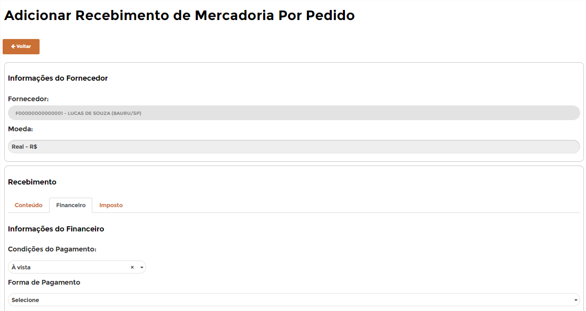

Segue as informações dos campos:

=== "Financeira"

	*	**Condições de Pagamento**: Informar a condição de pagamento dessa Nota Fiscal.

Por último é necessário informar o número da nota fiscal, caso for um documento fiscal, mas se não for é necessário informar um número sequencial.

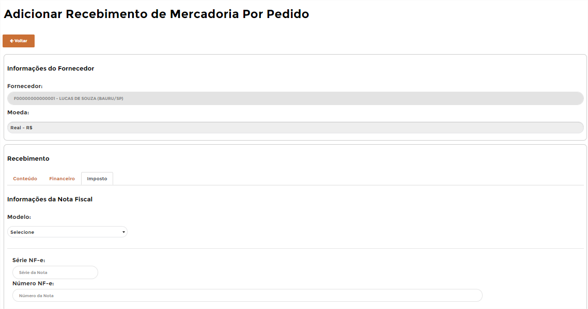

Segue as informações dos campos:

=== "Imposto"

	*	**Modelo**: Selecionar o EXTR (Externo).
	*	**Série NF-e**: Informar a série da NF-e.
	*	**Número NF-e**: Informar o número da NF-e.

Caso o **==Recebimento de Mercadoria - Pedido==** estiver certo irá aparecer uma mensagem de **Registro adicionado com sucesso" e será necessário clicar no botão **Voltar** para ir à página inicial do **==Recebimento de Mercadoria - Pedido==**.


O **==Recebimento de Mercadoria - Pedido==** irá entrar para fila de envio para o *SAP Business One*, durante esse processo o **Status** ficará :fontawesome-solid-circle:{ .preto }, caso der tudo certo o **Status** irá ficar :fontawesome-solid-circle:{ .verde } e se der algum erro ao integrar com o *SAP Business One* o **Status** irá ficar :fontawesome-solid-circle:{ .vermelho } e irá apresentar o erro.

---

## **Recebimento por Nota Fiscal de Saída**

A última opção é **==Recebimento de Mercadoria - Nota Fiscal de Saída==**, essa opção será utilizada caso exista o processo de transferência entre filiais, pois quando uma filial emitir uma **Nota Fiscal de Saída** para outra filial, deverá usar essa opção para criar um **==Recebimento de Mercadoria - Nota Fiscal de Saída==** baseado nessa transferência.

