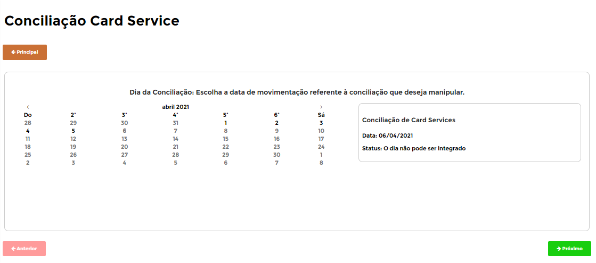
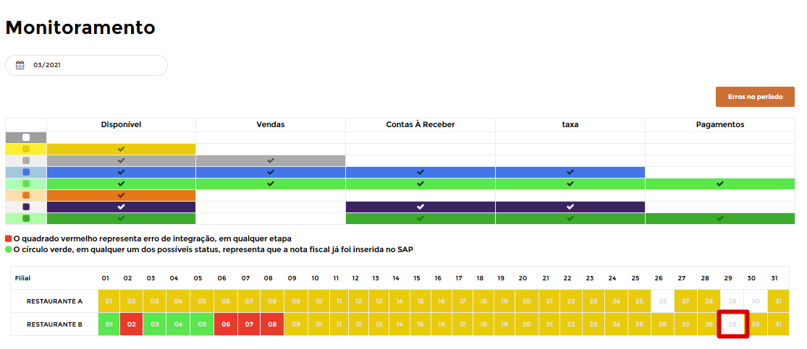
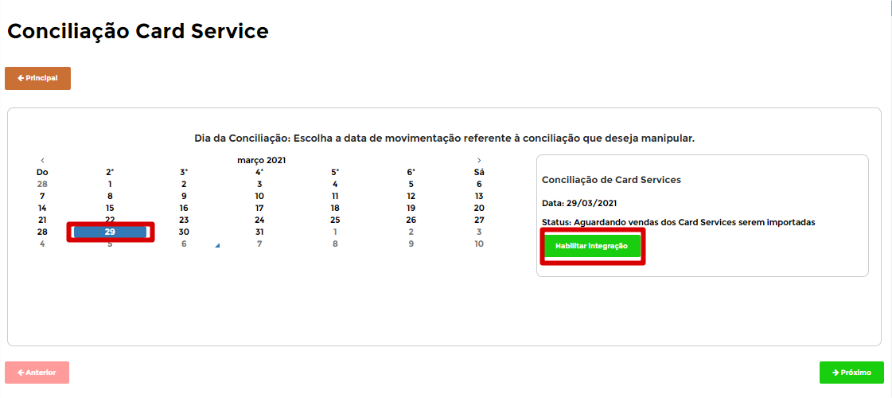
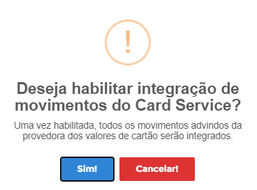
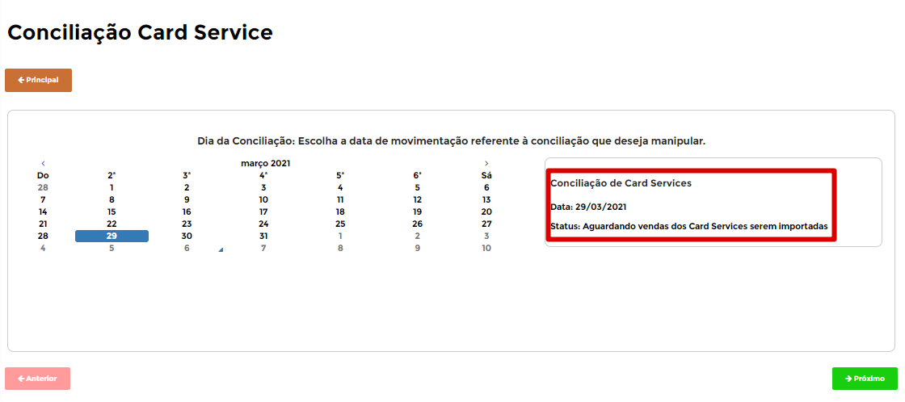

# **Conciliação de CardService**

***```
Menu: Conciliação -> Conciliação de CardService
```***

---

Esse módulo de **==Conciliação de CardService==** é para clientes que **contrataram integração com CardService** e será utilizado quando existe algum dia que o **estabelecimento não abriu**, com isso é necessário informar o B1Food para habilitar integração de CardService para poder enviar para o SAP Business as vendas e recebimentos de cartões daquele dia.



Primeiramente é necessário ter a certeza que o dia não teve vendas (pois é um processo sem volta), para ter uma certeza melhor podemos identificar no monitoramento se o dia está em **branco**



Após essa certeza, basta procurar o dia que deseja habilitar essa conciliação e clicar em **Habilitar integração**



O B1Food irá te perguntar se tem certeza (só por precaução), e para seguir com o processo é necessário selecionar **Sim**



Caso der certo, irá apresentar uma mensagem de **Sucesso**


Após essa **habilitação da integração** o dia já entra na fila da integração para importar as **vendas de cartões** e **recebimento de cartões**

