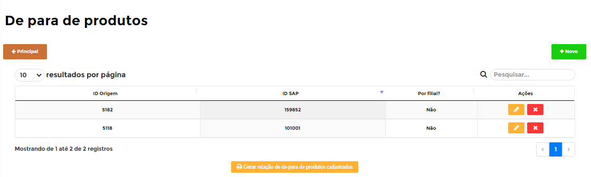
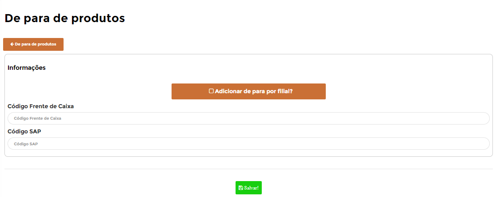
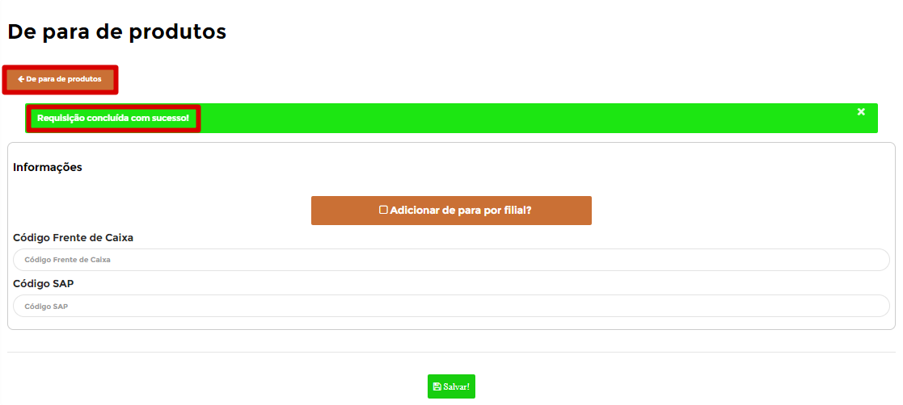
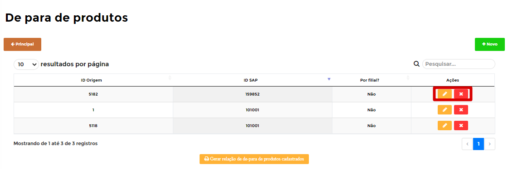
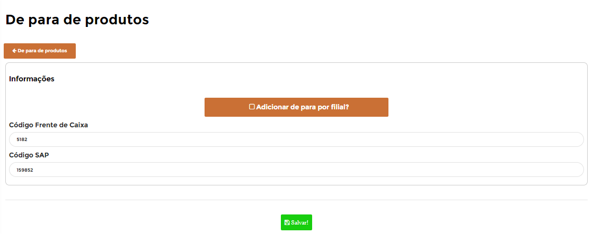
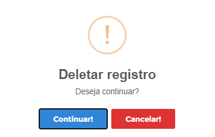

# **De Para de Produtos**

***```
Menu: Conciliação -> De Para de Produtos
```***

---

Esse módulo de **==De Para de Produtos==** é para clientes que o código do PDV (Ponto de Venda) é diferente do *SAP Business One*, portanto precisamos realizar esse **==De Para de Produtos==** para o B1Food conseguir criar o documento com os itens do SAP

Nessa tela principal irá apresentar todos os **==De Para de Produtos==** já criados e para criar um novo basta clicar em **Novo**



Nessa tela é necessário fazer o preenchimento dos campos e depois clicar em **Salvar**



Segue as informações dos campos:

=== "Campos"

	*	**Adicionar de para por filial?**: Informar caso esse **==De Para de Produto==** for exclusivo para a filial que está fazendo, se for igual para todas as unidades, não marcar.
	*	**Código frente de Caixa**: Informar o código do item do PDV
	*	**Código SAP**: Informar o código do item do SAP

Caso o **==De Para de Produtos==** estiver certo irá aprecer uma mensagem de **Registro adicionado com sucesso** e será necessário clicar no botão **Voltar** para ir na página inicial do **==Pedido de Compra==**



!!! warning "Validação dos dados"
	O B1Food não verifica se o item informado do PDV existe ou se o item informado do SAP existe, o que pode acontecer é quando for utilizado na importação da venda dê algum erro, mas nessa etapa não existe nenhuma validação.

Será listado o **==Pedido de Compra==** que acabou de criar e com isso será listado 4 ações para esse **==Pedido de Compra==**, segue abaixo explicativo de cada uma delas



=== ":fontawesome-solid-pen-square:{ .pen }"
	*	A ação **Editar** irá abrir o **==De Para de Produtos==** para realizar alguma edição
	{ align=left }

=== ":fontawesome-solid-window-close:{ .close }"
	*	A ação **Excluir** irá apagar o **==De Para de Produtos==** existente
	{ align=left }


