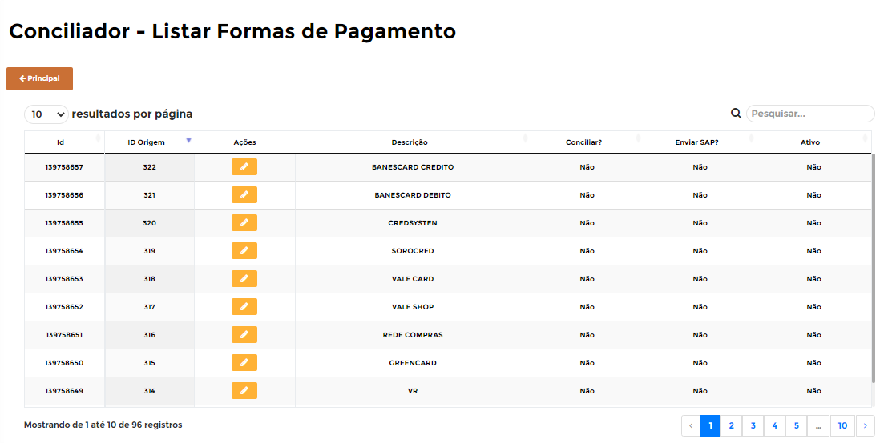
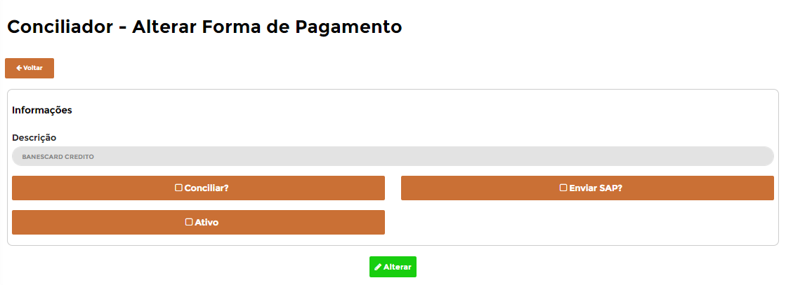

# **Formas de Pagamentos**

***```
Menu: Conciliação -> Formas de Pagamentos
```***

---

As **==Formas de Pagamentos==** são as **mesmas do seu PDV**, portanto caso cadastrar uma nova **==Formas de Pagamentos==** no seu PDV, ela irá automaticamente irá aparecer aqui no **próximo dia**.

Na tela inicial do **==Formas de Pagamentos==** é possível realizar algumas alterações nela, para isso basca clicar no botão **Alterar registro** :fontawesome-solid-pen-square:{ .pen }



Na tela de edição da **==Formas de Pagamentos==**, existe 3 configurações que podemos ajustar. Por padrão **todas** vem marcados, mas são alteradas na implantação conforme processo de cada filial, mas caso for criado uma nova **==Forma de Pagamentos==**, é necessário realizar **ajustes** caso necessário



=== "Configurações"

	*	**Conciliar?**: Se marcada, essa configuração irá possibilitar o usuário realizar a conciliação dessa **==Forma de Pagamentos==** no processo de **Realizar Conciliação**
	*	**Enviar SAP?**: Se marcada, essa configuração irá informar o B1Food de enviar os valores dessa **==Forma de Pagamentos==** para o *SAP Business One*
	*	**Ativo?**: Se mercada, essa configuração irá suprimir (esconder) essa forma de pagamento do processo de **Realizar Conciliação** caso ela não tiver valor (configuração usada para formas de pagamentos que não são mais utilizadas)

!!! warning "Clientes com CardService"
		Caso você tiver contratado CardService, todas as formas de pagamentos que irão vir dessa integração (dados das adquirentes) não podem estar marcado a configuração **Enviar SAP?**. A Opção **Conciliar?** até pode estar marcada, mas não terá nenhuma utilidade, portanto também sempre indicamos **desmarcar**

