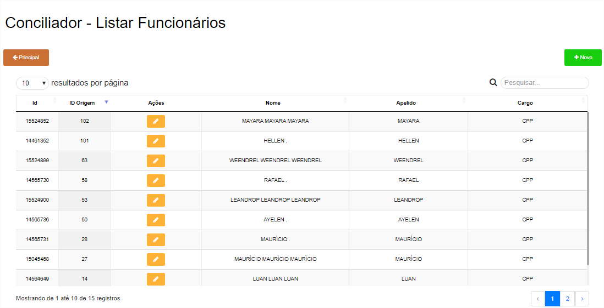
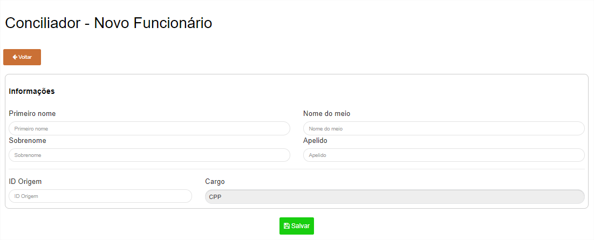
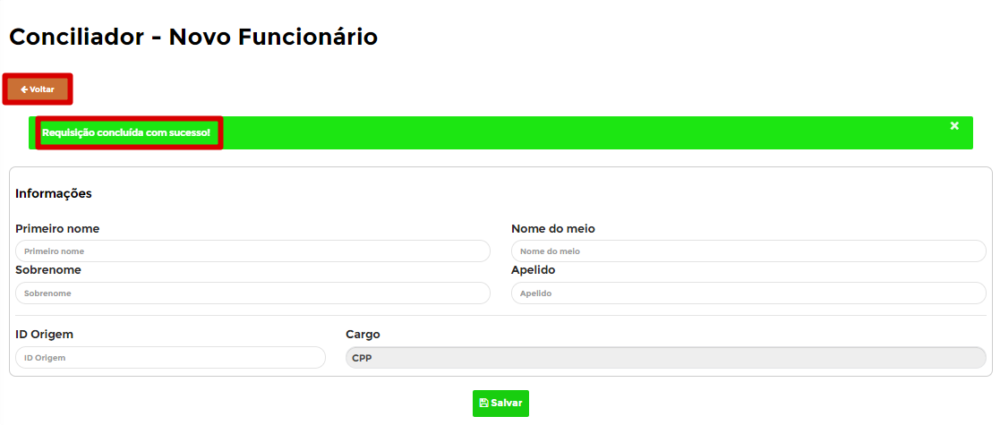
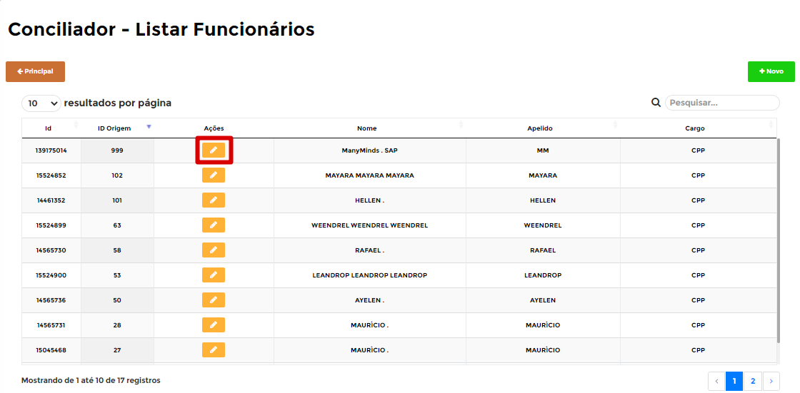
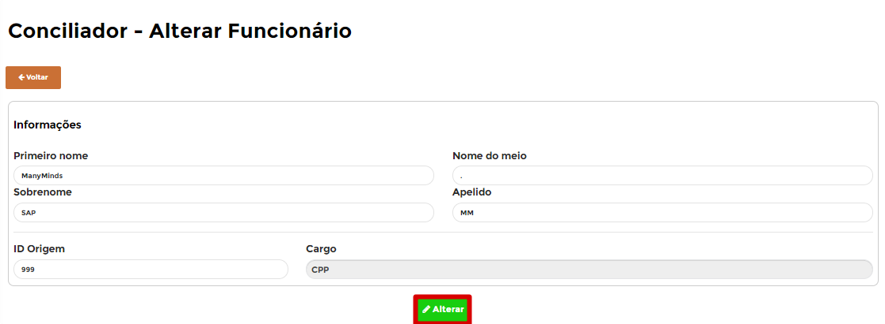

# **Funcionários da Conciliação**

***```
Menu: Conciliação -> Funcionários da Conciliação
```***

---

Os **==Funcionários da Conciliação==** do B1Food são os usuários que o frente de caixa (PDV/POS) nos envia, informando quem foi a pessoa do caixa que fez essa venda/recebimento e precisamos realizar esse cadastro para informar alguns dados à mais para **carregar o dia** e depois realizar a conciliação.

Na tela inicial da **==Funcionários da Conciliação==** é possível ver todas que já foram criadas.



Para conseguir criar uma, basta clicar em **Novo** e na próxima tela é necessário preencher os campos e clicar no botão **Salvar**.



=== "Campos"

	*	**Primeiro Nome**: Informar o primeiro nome do funcionário.
	*	**Nome do Meio**: Informar o nome do meio do funcionário (caso não tiver, pode deixar em branco).
	*	**Sobrenome**: Informar o sobrenome do funcionário (caso não tiver, pode infomrar um ponto (.)).
	*	**Apelido**: Informar o Apelido do Funcionário, geralmente usamos o mesmo do Primeiro Nome.
	*	**ID Origem**: Informar o ID do Funcionário do PDV (Caso analisou o erro no Log de Importações, ele irá te mostrar o ID).

Caso o **==Funcionário da Conciliação==** estiver certo irá aparecer uma mensagem de **Registro adicionado com sucesso** e será necessário clicar no botão **Voltar** para ir na página inicial do **==Funcionários da Conciliação==**



Será listado o **==Funcionário da Conciliação==** que acabou de criar e com isso será listado 1 ação para esse **==Funcionário da Conciliação==**, segue abaixo explicativo dele:



=== ":fontawesome-solid-pen-square:{ .pen }"
	*	A ação **Editar** irá abrir o **==Funcionário da Conciliação==** para realizar alguma edição
	{ align=left }
