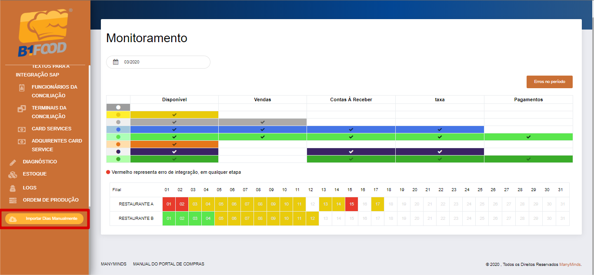
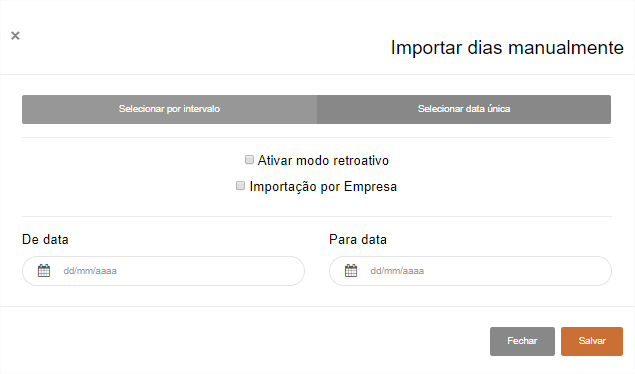
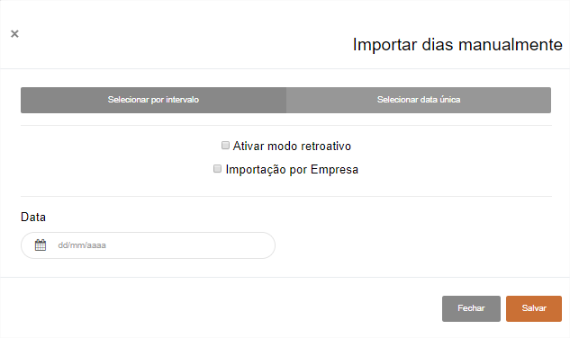

# **Importar Dias Manualmente**

***```
Menu: Importar Dias Manualmente
```***

---

O B1Food importa as vendas automaticamente do frente de caixa, mas caso haja um **erro** ele não ficará forçando a **importação sempre**, 
realiza **algumas tentativas** e se continuar com erro ele para de ficar tentando.

Portanto caso algum dia não esteja disponível, e foi analisado no **Log de Importações** que faltava cadastrar um terminal/funcionário, após a realização deste cadastro será necessário importar esse dia(s) manualmente, portanto será necessário usar a importação manual. Caso no **Log de Importações** apresentar um outro erro, solicitamos para tentar importar 1x manualmente e caso o erro continuar é necessário entrar em contato com o **Suporte da ManyMinds**.



Existe **2 tipos de importação**, a primeira seria **Selecionar por intervalo**, onde é possível informar a **Data inicial** e **Data final** e caso esses dias forem iguais para todas as filiais é possível selecionar o flag **Importação por Empresa** que o B1Food irá reprocessar os dias para todas as filiais.


!!! warning "Atenção"
	Cuidado em selecionar Ativar modo retroativo, pois isso é feito para a primeira carga apenas.




O segundo tipo seria **Selecionar data única**, onde é possível informar apenas 1 data e caso esses dias forem iguais para todas as filiais é possível selecionar o flag **Importação por Empresa** que o B1Food irá reprocessar os dias para todas as filiais.


!!! warning "Atenção"
	Cuidado em selecionar Ativar modo retroativo, pois isso é feito para a primeira carga apenas.




