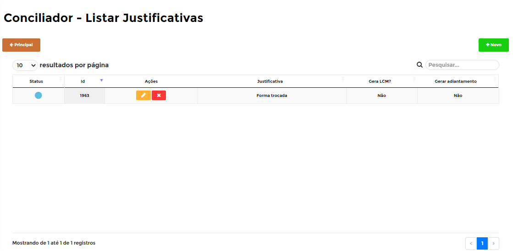
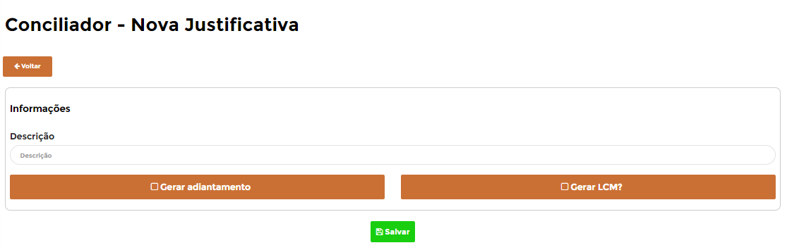
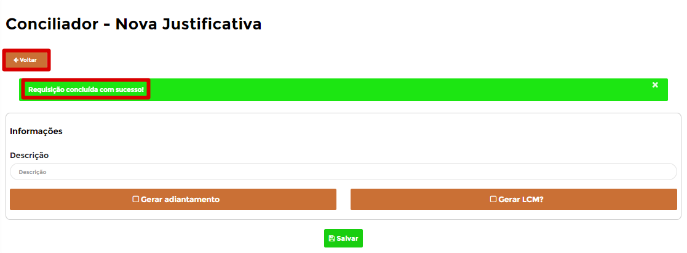
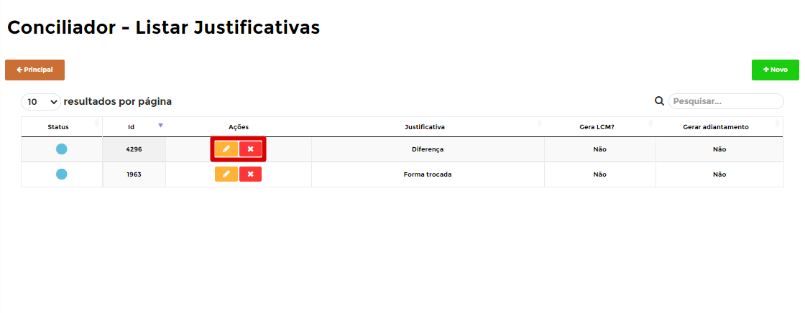
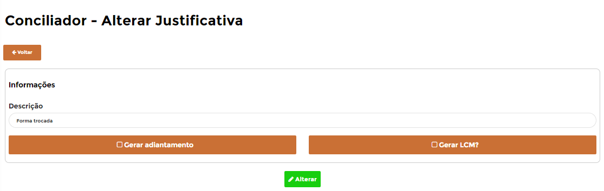

# **Justificativas**

***```
Menu: Conciliação -> Justificativas
```***

---

As **==Justificativas==** são utilizadas no processo de **Realizar Conciliação**, onde caso der diferença do valor conciliado com o valor do PDV, o usuário precisa **Justificar** essa diferença.

Na tela inicial irá listar todas as **==Justificativas==** já criadas, portanto é possível criar novas ou editar as já existentes. 



Para conseguir criar uma nova, basta clicar em **Novo** e na próxima tela é necessário informar os campos necessários e depois clicar em **Salvar**.



Segue as informações dos campos:

=== "Campos"

	*	**Descrição**: Informar a descrição dessa justificativa.
	*	**Gera adiantamento**: Informar se a diferença dessa justificativa irá gerar um adiantamento contra o cliente.
	*	**Gera LCM**: Informar se a diferença dessa justificativa irá gerar um lançamento contábil, esse flag que dizer que vai entrar o valor bruto (do PDV) e depois o B1Food realiza um LCM da diferença justificada.
	!!! warning "Atenção"
		Essa função irá funcionar corretamente apenas para **Dinheiro**.

Caso a **==Justificativa==** estiver certo irá aparecer uma mensagem de **Registro adicionado com sucesso** e será necessário clicar no botão **Voltar** para ir na página inicial da **==Justificativas==**.



Será listado a **==Justificativa==** que acabou de criar e com isso será listado 2 ações para essa **==Justificativa==**, segue abaixo explicativo de cada uma delas.



=== ":fontawesome-solid-pen-square:{ .pen }"
	*	A ação **Editar** irá abrir a **==Justificativa==** para realizar alguma edição.
	{ align=left }

=== ":fontawesome-solid-window-close:{ .close }"
	*	A ação **Desativar registro** irá desativar a **==Justificativa==** criada.
	{ align=left }
