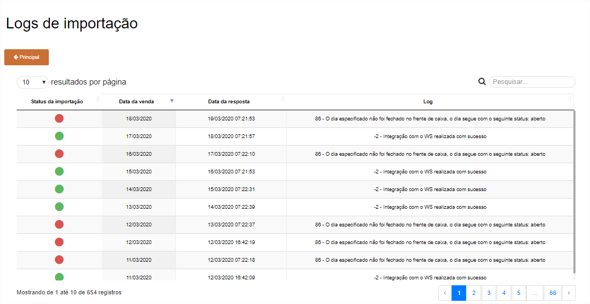

# **Log de Importações**

***```
Menu: Conciliação -> Log de Importações
```***

---

A tela de **==Log de Importações==** irá demonstrar todas as movimentações com integração com o PDV (positiva ou negativa), portanto caso algum dia não estiver disponível para **Realizar Conciliação**, essa tela é um bom começo para analisar o motivo de não estar disponível



!!! Legenda

	=== "Status"
		**:fontawesome-solid-circle:{ .verde } - Importação concluída**: Esse **Status** quer dizer que foi importado o dia do PDV para o B1Food

		**:fontawesome-solid-circle:{ .vermelho } - Falha na importação**: Esse **Status** quer dizer que não foi importado o dia do PDV para o B1Food

Segue as informações dos campos:

=== "Campos"

	*	**Data da Venda**: Será informado a data da venda que o B1Food fez a busca
	*	**Data da Resposta**: Será informado a data que o B1Food fez a busca (dia que realizou a operação e não da venda)
	*	**Log**: Será informado a descrição do Log, portanto caso o Status for **Falha na importação**, é nesse campo que será informado o motivo da falha.
