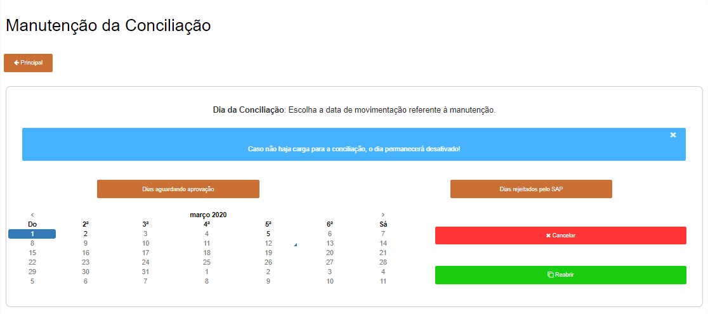
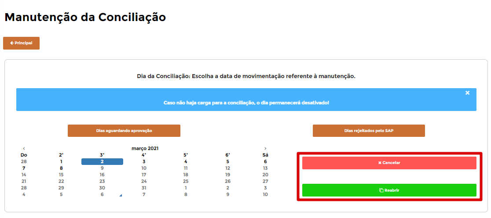

# **Manutenção**

***```
Menu: Conciliação -> Manutenção
```***

---

Na tela de **==Manutenção==** é possível **reabrir** ou **cancelar** um dia que já começou à ser conciliado ou um dia finalizado



!!! warning "Reabrir ou Cancelar"
	Lembrando que caso abra um dia já importado no *SAP Business One*, não irá atualizar as informações alteradas. Caso deseje cancelar um dia e importar novamente no B1Food, será necessário **realizar o processo de cancelamento** no *SAP Business One*.

Para realizar essas operações, primeira coisa é encontrar o dia que deseja **reabrir** ou **cancelar**.



=== ":fontawesome-solid-window-close:{ .close }"
	*	A ação **Cancelar** irá cancelar a **conciliação** criada e terá que refazer tudo (perde os dados informados no B1Food)
	
	{ align=left }

=== ":fontawesome-solid-file:{ .verde }"
	*	A ação **Reabrir** irá abrir o dia para realizar algum ajuste (não perde os dados informados no B1Food)

	{ align=left }