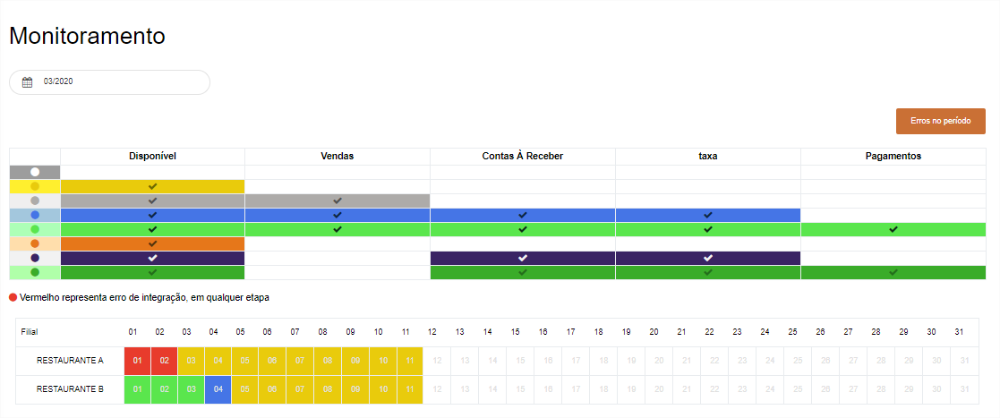
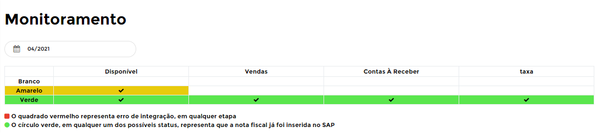
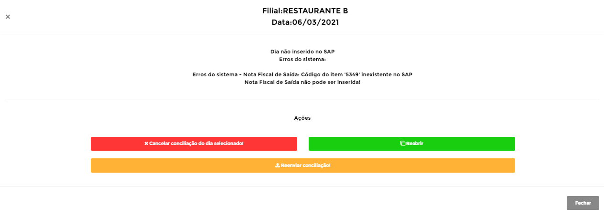
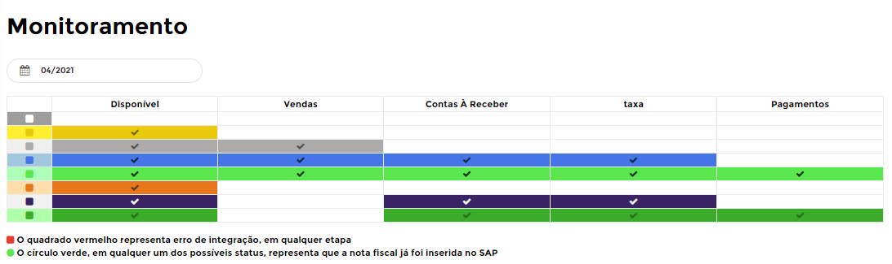

# **Monitoramento**

***```
Menu: Conciliação -> Monitoramento
```***

---

O **==Monitoramento==** irá mostrar o **Status** de cada dia e de cada loja, um jeito simples e prático para monitorar a integração com o PDV. A **Legenda** das cores pode mudar, se você tiver **contratado** a integração com CardService ela será de uma maneira e se você **não tiver contratado** ela será de outra maneira, mas irei **demostrar as duas** para você.

*[PDV]: Ponto de Venda



## **Sem CardService**


!!! Legenda

	=== "Status"
		**:fontawesome-solid-circle:{ .monitoramento_01 } - Dia não importado**: Esse **Status** quer dizer que não existe venda no B1Food para esse dia, caso teve venda é necessário verificar o Log de Importações

		**:fontawesome-solid-circle:{ .monitoramento_02 } - Dia liberado mas não conciliado**: Esse **Status** quer dizer que o B1Food conseguiu carregar as vendas do PDV mas precisa realizar a conciliação

		**:fontawesome-solid-circle:{ .monitoramento_03 } - Dia finalizado**: Esse **Status** quer dizer que foi feito a Conciliação e os documentos integrados ao *SAP Business One* (Nota Fiscal de Saída + Vendas de Cartões + Taxas)

		**:fontawesome-solid-circle:{ .monitoramento_04 } - Dia não inserido no SAP**: Esse **Status** quer dizer que ocorreu algum erro na inserção no *SAP Business One*, necessário abrir o dia para analisar o(s) erro(s).

No **==Monitoramento==** podemos ver o **Status** do dia mais detalhado, até **Reabrir** ou **Cancelar** o dia (igual na tela de **Manutenção**) e **Reenviar** o dia para integração caso ele apresentou algum erro (:fontawesome-solid-circle:{ .monitoramento_04 }) da primeira vez. Para isso só clicar encima do dia/loja que deseja realizar essas operações



Segue as informações dos campos:

=== "Botões"

	*	**Cancelar conciliação do dia selecionado**: Irá cancelar a conciliação realizada e terá que refazer.
	*	**Reabrir**: Irá abrir a conciliação realizada e poderá realizar os ajustes necessários.
	*	**Reenviar conciliação**: Caso apresentou erro e eles foram corrigidos, pode **Reenviar** a dia para entrar na fila de integração.
 
!!! warning "Reabrir ou Cancelar"
	Lembrando que caso abra um dia já importado no *SAP Business One*, não irá atualizar as informações alteradas. Caso deseje cancelar um dia e importar novamente no B1Food, será necessário **realizar o processo de cancelamento** no *SAP Business One*.

## **Com CardService**


!!! Legenda

	=== "Status"
		**:fontawesome-solid-circle:{ .monitoramento_01 } - Dia não importado**: Esse **Status** quer dizer que não existe venda no B1Food para esse dia, caso teve venda é necessário verificar o Log de Importações

		**:fontawesome-solid-circle:{ .monitoramento_02 } - Dia liberado mas não conciliado**: Esse **Status** quer dizer que o B1Food conseguiu carregar as vendas do PDV mas precisa realizar a conciliação

		**:fontawesome-solid-circle:{ .monitoramento_05 } - Aguardando vendas do cardservice serem importadas**: Esse **Status** quer dizer que foi feito a Conciliação e o B1Food criou a Nota Fiscal de Saída no *SAP Business One*, está aguardando os cartões do CardService

		**:fontawesome-solid-circle:{ .monitoramento_06 } - Aguardando pagamentos do cardservice serem importadas**: Esse **Status** quer dizer que foi criado a Nota Fiscal de Saída e Contas à Receber dos cartões vendidos no *SAP Business One*, está aguardando os recebimentos de cartões do CardService

		**:fontawesome-solid-circle:{ .monitoramento_03 } - Pagamentos de CardService inseridos no SAP**: Esse **Status** quer dizer que foi criado a Nota Fiscal de Saída, Contas à Receber dos cartões vendidos e Recebimentos dos cartões do CardService

		**:fontawesome-solid-circle:{ .monitoramento_07 } - Aguardando vendas do cardservice serem importadas**: Esse **Status** quer dizer que está aguardando os cartões do CardService (dia não teve venda no PDV)

		**:fontawesome-solid-circle:{ .monitoramento_08 } - Pagamento CardService aguardando inserção**: Esse **Status** quer dizer que foi inserido o Contas à Receber dos cartões vendidos e está aguardando os recebimentos de cartões do CardService (dia não teve venda no PDV)

		**:fontawesome-solid-circle:{ .monitoramento_09 } - Pagamentos de CardService inseridos no SAP**: Esse **Status** quer dizer que foi criado o Contas à Receber dos cartões vendidos e Recebimentos dos cartões do CardService (dia não teve venda no PDV)

		**:fontawesome-solid-circle:{ .monitoramento_04 } - Erro**: Esse **Status** quer dizer que o *SAP Business One* gerou algum erro, para saber qual é basta clicar no dia

No **==Monitoramento==** podemos ver o **Status** do dia mais detalhado, até **Reabrir** ou **Cancelar** o dia (igual na tela de **Manutenção**) e **Reenviar** o dia para integração caso ele apresentou algum erro da primeira vez. Para isso só clicar encima do dia/loja que deseja realizar essas operações


Segue as informações dos campos:

=== "Botões"

	*	**Cancelar conciliação do dia selecionado**: Irá cancelar a conciliação realizada e terá que refazer.
	*	**Reabrir**: Irá abrir a conciliação realizada e poderá realizar os ajustes necessários.
	*	**Reenviar conciliação**: Caso apresentou erro e eles foram corrigidos, pode **Reenviar** a dia para entrar na fila de integração.
 
!!! warning "Reabrir ou Cancelar"
	Lembrando que caso abra um dia já importado no *SAP Business One*, não irá atualizar as informações alteradas. Caso deseje cancelar um dia e importar novamente no B1Food, será necessário **realizar o processo de cancelamento** no *SAP Business One*.