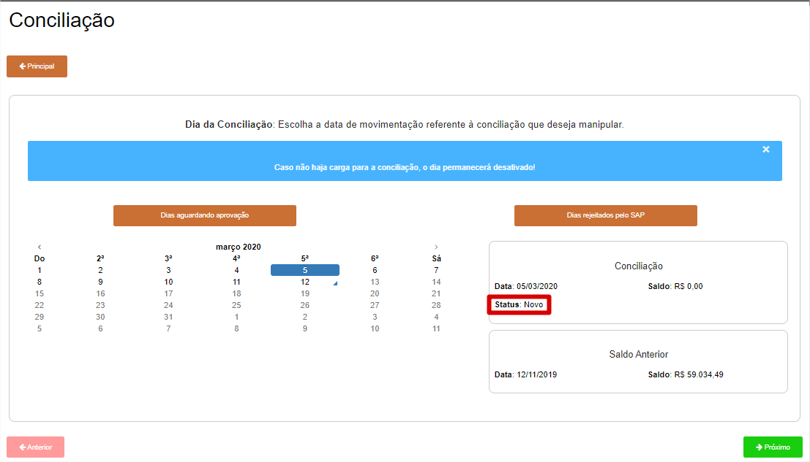
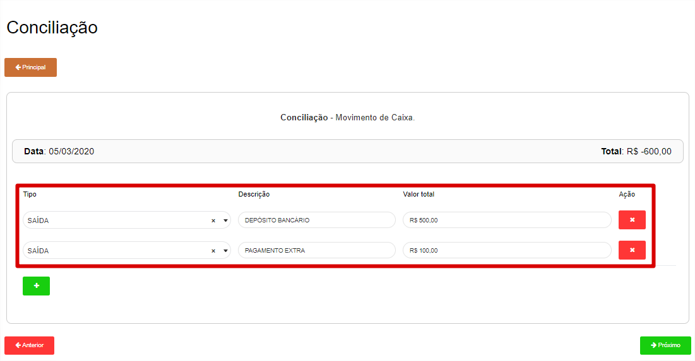
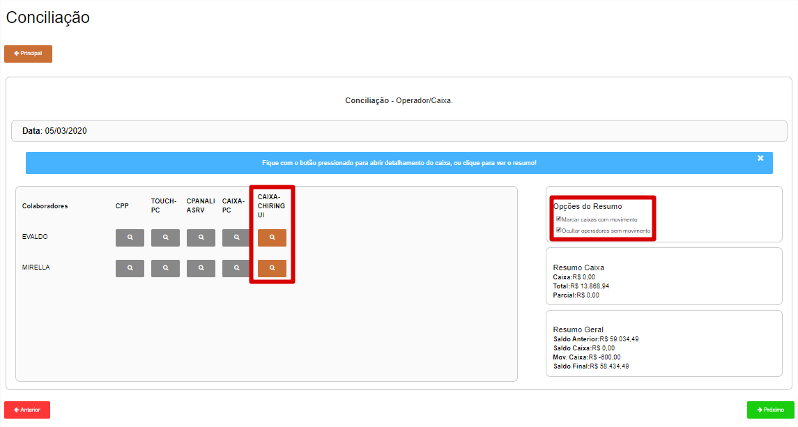
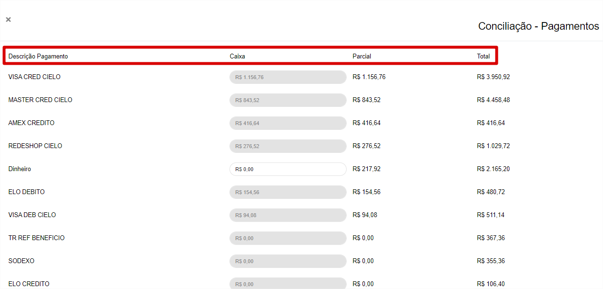
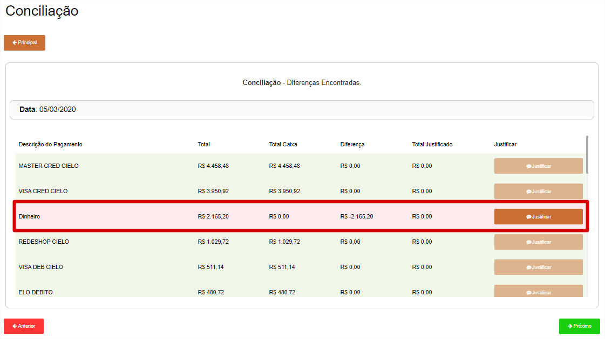
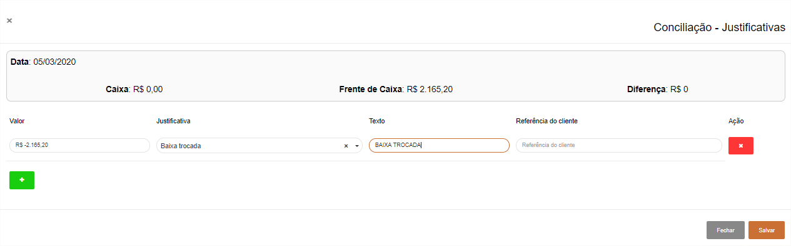
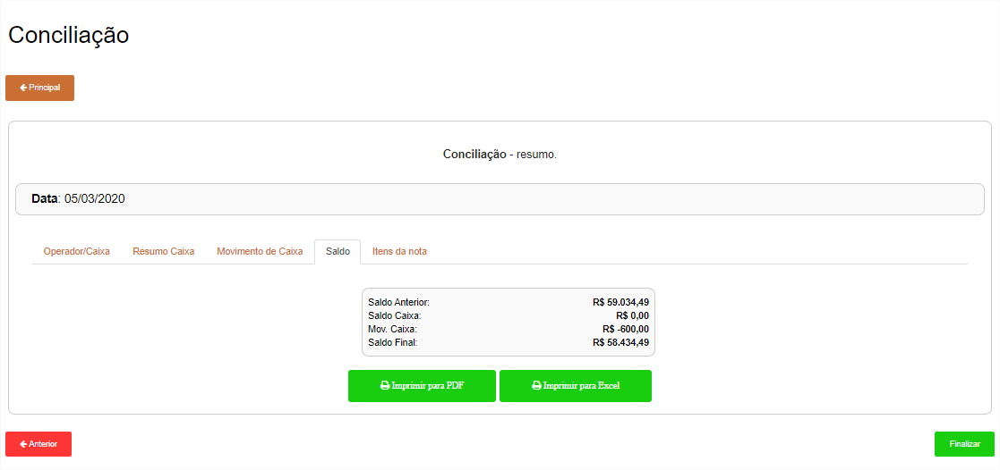
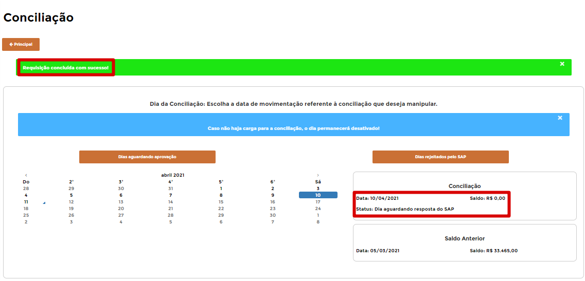

# **Realizar Conciliação**

***```
Menu: Conciliação -> Realizar Conciliação
```***

---

A **Conciliação** é utilizada para ajustar possíveis valores financeiros (formas de pagamentos), portanto é possível nesse processo ajustar os valores de cartões, dinheiro, informar alguma saída de dinheiro do caixa para algum pagamento ou algo do tipo. A ideia uma validação extra antes dos valores entrarem no *SAP Business One*.

O dia ficará disponível no B1Food para realizar a conciliação sempre no D+1 (portanto hoje, o usuário irá fazer a conciliação da venda realizada no dia anterior).

Na tela de **==Realizar conciliação==** será necessário escolher o dia que deseja conciliar, para saber isso basta clicar no dia e analisar o **Status**. Caso o dia esteja como **Novo**, basta clicar em **Próximo**



!!! Legenda

	=== "Status"
		*	**Dia não disponível**: Dia não disponível para fazer a conciliação, analisar com as vendas do PDV
		*	**Novo**: Dia disponível para realizar a conciliação
		*	**Dia não inserido no SAP**: Gerou algum erro no momento da inserção da venda no SAP.
		*	**Dia aguardando resposta do SAP**: Aguardando o B1Food processar a venda no SAP.
		*	**Finalizado**: Processo realizado com sucesso.

Na tela de **Movimento de Caixa** poderá informar as saídas do dinheiro, como depósito de dinheiro, pagamento de extra, EX: pagamento de chaveiro, onde o B1Food irá realizar um **Lançamento Contábil Manual** no *SAP Business One*, tirando da conta caixa e colocando em uma conta 
chamada **Lançamento de Caixa a Identificar**, onde a equipe do **BackOffice** irá reclassificar isso.



Na tela de **Operador/Caixa** irá listar todos os colaboradores e caixas (isso pode mudar **conforme configuração**, 
onde possível aparecer 1 caixa e 1 operador). Para facilitar e saber quais tiverem movimento, basta usar o flag de **Opções de Resumo**.



Ao clicar no caixa desejado, irá listar as **formas de recebimentos do frente de caixa**. Nesta lista a coluna **Caixa** é o valor conciliado,
onde será informado qual o valor correto, a coluna **Parcial** é o valor do caixa que escolheu e a coluna **Total** é o valor total de todos os caixas.


!!! warning "Formas de Pagamento em Cinza"
	Quando isso acontecer, é que esses valores que foram informados no PDV não serão utilizados, 
	portanto caso você tenha integração com CardService, possivelmente os cartões que irão vir das 
	Adquirentes você não precisa se preocupar aqui na conciliação.

Caso o valor de alguma forma de pagamento for **diferente** do frente de caixa, será necessário justifica-la.



Nessa tela de **Justificativas**, pode ser 1 ou mais, mas precisa sempre zerar o valor de **Diferença**;



No final de cada conciliação será demonstrado um resumo, para **validação**. Caso estiver correto, clique no botão **Finalizar**.



Após **Finalizar** irá retornar para página inicial, onde o dia que foi **Conciliado** irá ficar com o Status **Dia aguardando resposta do SAP**, isso quer dizer que entrou na fila da integração.

