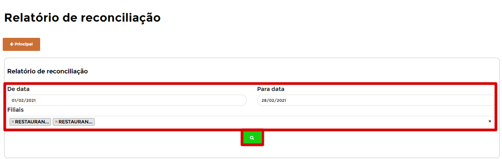
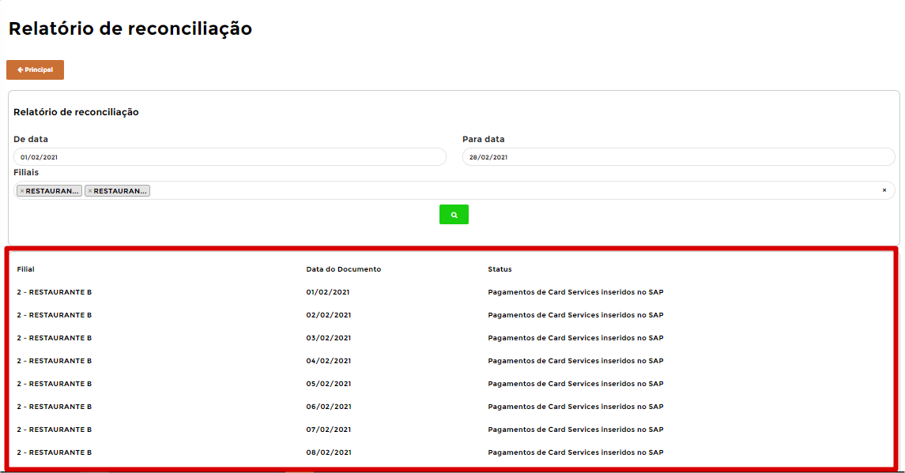
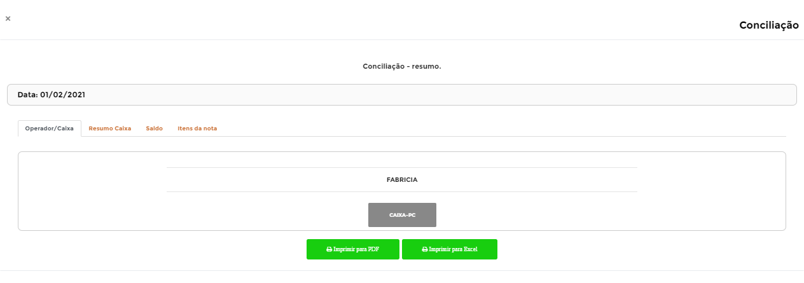

# **Relatório de Conciliação**

***```
Menu: Conciliação -> Relatório de Conciliação
```***

---

O **==Relatório de Conciliação==** é uma tela para centralizar a consulta do **Resumo de Conciliação**, podendo gerar de vários dias e de várias filiais também.

Na tela principal, é necessário realizar o preenchimento dos seguintes filtros e clicar no **Botão** :fontawesome-solid-search:{ .verde }.



=== "Filtros"

	*	**De data**: Informar a **Data Inicial** da busca das conciliações.
	*	**Para data**: Informar a **Data Final** da busca das conciliações.
	*	**Filiais**: Informar as filiais que deseja realizar o filtro (podendo ser 1 ou várias).

Após clicar no **Botão** :fontawesome-solid-search:{ .verde }, irá aparecer uma mensagem **Sucesso - Requisição concluída com sucesso** informando que a requisição dos dados foi realizada e pode clicar no botão **Ok** para voltar na tela principal.


Logo após os campos de **filtros**, irá listar todos os **dias das filiais solicitadas**, informando qual é a Filial, Data e Status atual.



Para acessar o **Resumo**, basta clicar na linha que deseja e irá abrir a tela de resumo automaticamente, podendo sair do resumo que abriu e entrar em outros dias caso necessário.

