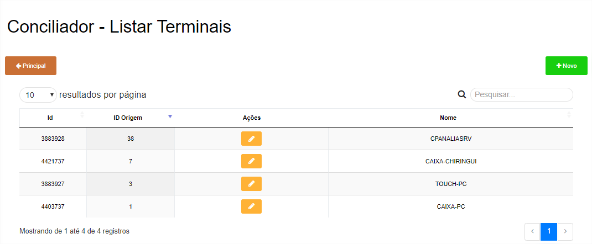
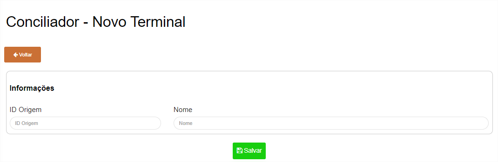
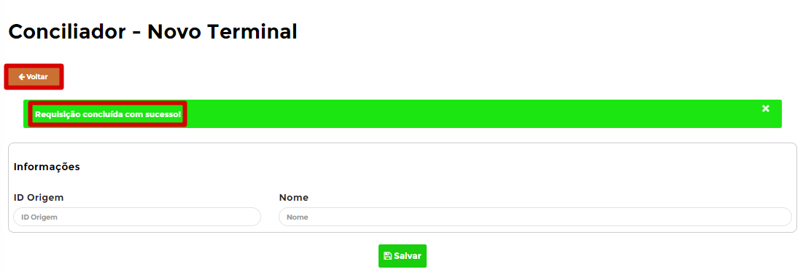
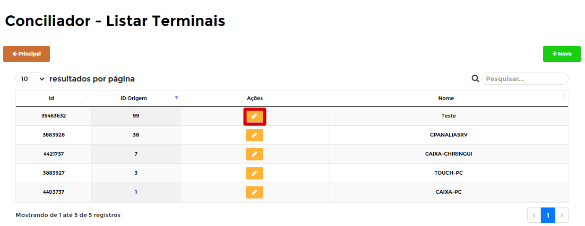
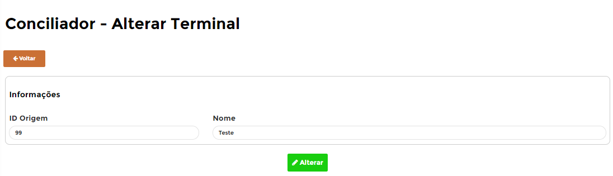

# **Terminais da Conciliação**

***```
Menu: Conciliação -> Terminais da Conciliação
```***

---

Os **==Terminais==** do B1Food são os **caixas que o frente de caixa (PDV/POS) nos envia**, informando aonde foi realizada essa venda/recebimento e precisamos realizar esse cadastro para informar algumas informações complementares para carregar o dia e depois realizar a conciliação.

Na tela inicial da **==Terminais==** é possível ver todas que já foram criadas e qual o **Status** de cada uma delas.



Para conseguir criar uma nova, basta clicar em **Novo** e na próxima tela é necessário preencher os campos



Segue as informações dos campos: 

=== "Cabeçalho"

	*	**ID Origem**: Informar o ID do Terminal do PDV (Essa informação irá apresentar quando der algum erro no **Log de Importações**)
	*	**Nome**: Informar o Nome do Terminal do PDV (Essa informação irá apresentar quando der algum erro no **Log de Importações**)

Caso o **==Terminal==** estiver certo irá aparecer uma mensagem de **Registro adicionado com sucesso** e será necessário clicar no botão **Voltar** para ir na página inicial do **==Terminal==**



Será listado o **==Terminal==** que acabou de criar e com isso será listado 1 ação para esse **==Terminal==**, segue abaixo explicativo dele:



=== ":fontawesome-solid-pen-square:{ .pen }"
	*	A ação **Editar** irá abrir o **==Terminal==** para realizar alguma edição
	{ align=left }

