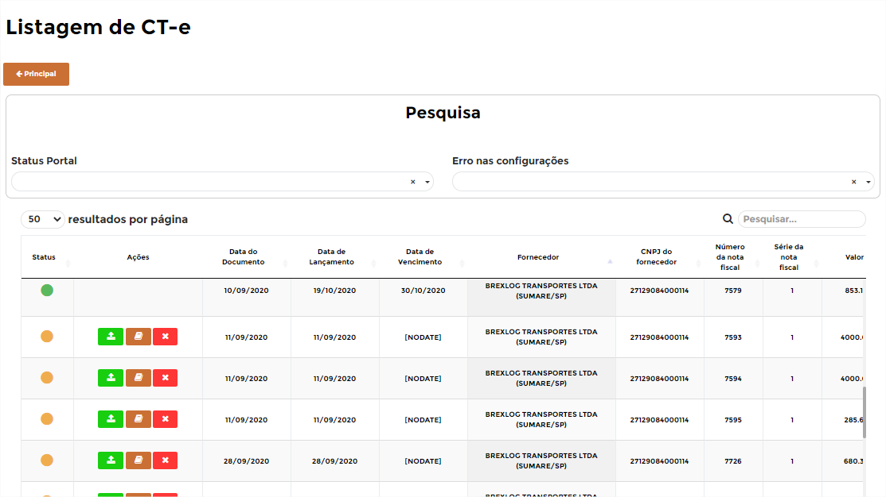
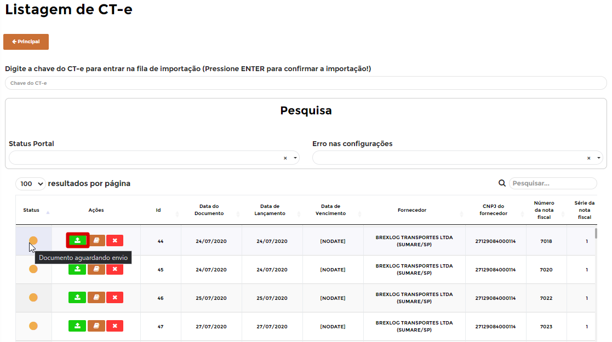
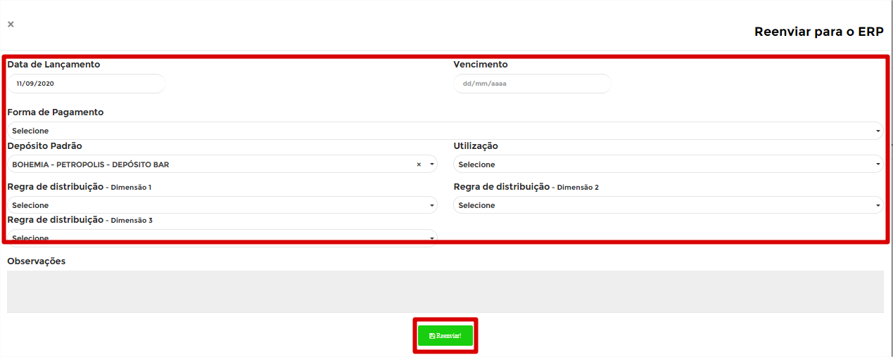
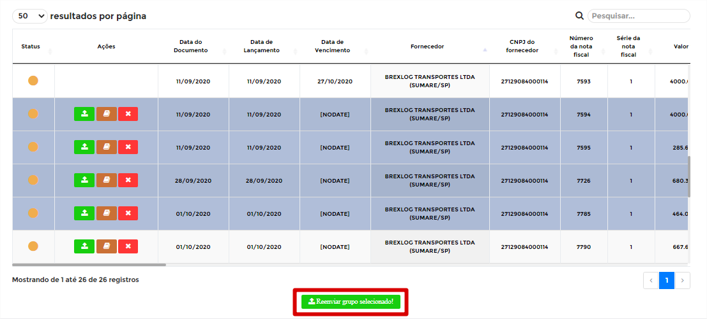
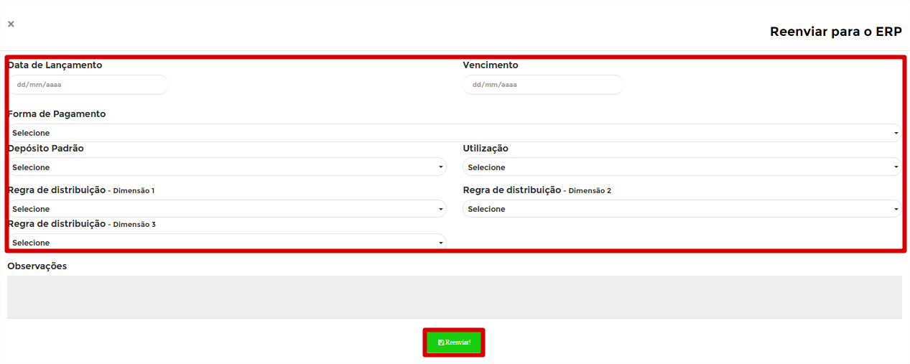

# **Listagem de CT-e**

***```
Menu: Documentos Fiscais -> Listagem de CT-e
```***

---

A **==Listagem de CT-e==** são todos os **Conhecimentos de Transportes Eletrônicos** emitidos contra o CNPJ da Filial do B1Food e você realiza o pagamento dele, portanto será criado uma **Nota Fiscal de Entrada** no *SAP Business One* e pode ser importado em lote (sendo a mesmos dados de datas, utilização, depósito e regras de distribuição) ou unitário.

Na tela inicial da **==Listagem de CT-e==** é possível consultar todas que já foram criadas e qual o **Status** de cada uma delas.



!!! Legenda

	=== "Status"
		**:fontawesome-solid-circle:{ .vermelho } - Documento mal informado**: Esse **Status** quer dizer que o fornecedor do **==CT-e==** não existe no *SAP Business One*, portanto é necessário criar esse fornecedor no SAP e depois clicar na ação de **Verificar Documento**.

		**:fontawesome-solid-circle:{ .laranja } - Aguardando envio**: Esse **Status** quer dizer que o **==CT-e==** está aguardando para ser enviada para entrar na fila da integração com *SAP Business One*.

		**:fontawesome-solid-circle:{ .preto } - Aguardando integração**: Esse **Status** quer dizer que o **==CT-e==** está na fila para integração no *SAP Business One*.

		**:fontawesome-solid-circle:{ .verde } - Pedido Finalizado**: Esse **Status** quer dizer que foi criado um Recebimento de Mercadoria total com base o **==Pedido de Compra==**.

		**:fontawesome-solid-circle:{ .vermelho } - Erro**: Esse **Status** quer dizer que o *SAP Business One* gerou algum erro, para saber qual é basta posicionar o cursor em cima do **Status**.

Para importar apenas 1 CT-e, basta clicar no primeiro botão da esquerda das ações **Reenviar**, preencher os dados da tela seguinte e depois clicar em **Reenviar**.



!!! warning "CT-e"
		Para **reenviar** o CT-e, o **status** precisa estar **Documento Aguardando Envio**.



Segue as informações dos campos:

=== "Campos"

	*	**Data de Lançamento**: Informar a Data de Lançamento, quando será contabilizado o CT-e.
	*	**Data de Vencimento**: Informar a Data de Vencimento, quando será pago o CT-e.
	*	**Forma de pagamento**: Informar a forma de pagamento que será realizado para esse CT-e.
	*	**Depósito padrão**: Informar o depósito para esse item (**geralmente o padrão**).
	*	**Utilização**: Informar a utilização do CT-e.
	*	**Regras de distribuição**: Informar os centros de custos liberado para seu acesso, se tiver 3 dimensões liberadas, terá 3 campos de regras de distribuição.
	*	**Observações**: Informar alguma observação se necessário.

Após isso ele irá ficar o status :fontawesome-solid-circle:{ .preto } - **Aguardo integração SAP** e se der certo o Status irá ficar :fontawesome-solid-circle:{ .verde } - **Finalizado**.

Para importação em Lote, é necessário selecionar todos os CT-e´s deseja fazer a importação, lembrando que as **todas as informações** serão as mesmas para todos os CT-e´s selecionados.



!!! warning "CT-e"
		Para **reenviar** o CT-e, o **status** precisa estar **Documento Aguardando Envio**.

Após todos selecionados, basta clicar em **Reenviar grupo selecionado**, preencher as informações que serão solicitadas e clicar em **Reenviar**.



=== "Campos"

	*	**Data de Lançamento**: Informar a Data de Lançamento, quando será contabilizado o CT-e.
	*	**Data de Vencimento**: Informar a Data de Vencimento, quando será pago o CT-e.
	*	**Forma de pagamento**: Informar a forma de pagamento que será realizado para esse CT-e.
	*	**Depósito padrão**: Informar o depósito para esse item (**geralmente o padrão**).
	*	**Utilização**: Informar a utilização do CT-e.
	*	**Regras de distribuição**: Informar os centros de custos liberado para seu acesso, se tiver 3 dimensões liberadas, terá 3 campos de regras de distribuição.
	*	**Observações**: Informar alguma observações se necessário.

!!! warning "CT-e"
		Todos os dados informados nessa tela serão **iguais** para todos os CT-e´s.

Após isso ele irá ficar o status :fontawesome-solid-circle:{ .preto } - **Aguardo integração SAP** e se der certo o Status irá ficar :fontawesome-solid-circle:{ .verde } - **Finalizado**.


