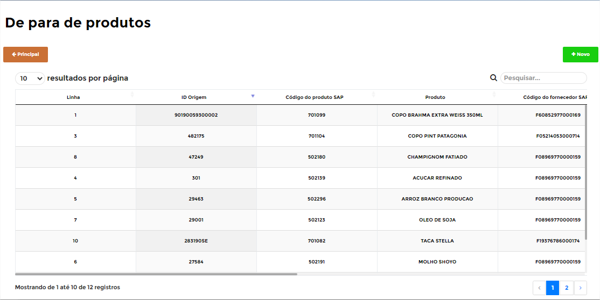
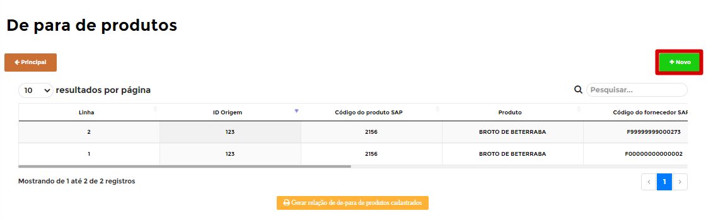
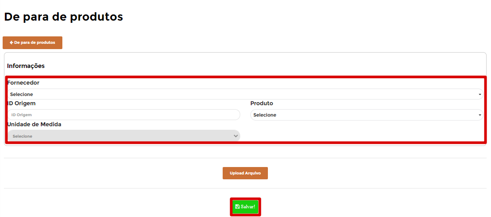
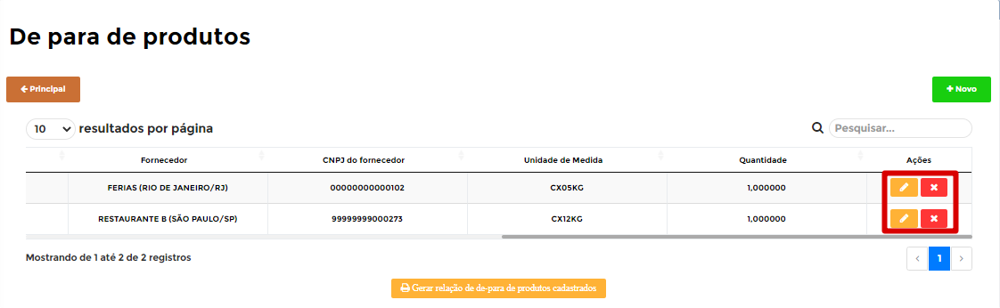
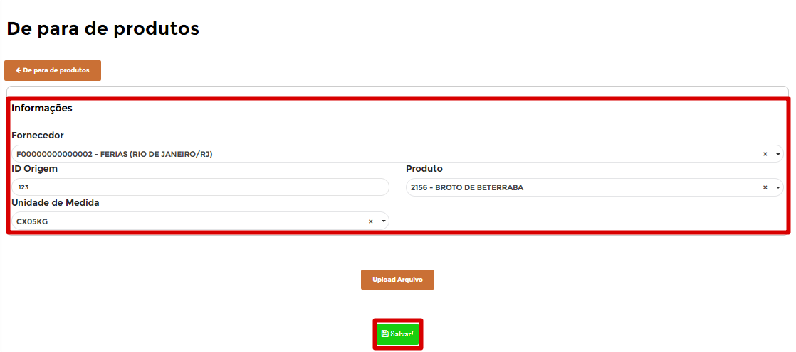
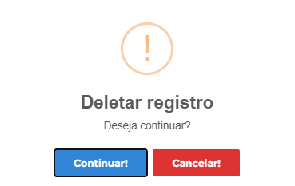

# **De Para de Produtos**

***```
Menu: Documentos Fiscais -> De Para de Produtos
```***

---

O **==De Para de Produtos==** é utilizado para criar o **DE PARA** do **código do SAP** Business One com o código do produto do seu **fornecedor**, por exemplo:

O Código do seu item (ÁGUA COM GÁS) no ***SAP Business One* é 101001**, e quando for comprar esse produto do **Fornecedor A** o código dele é **12345** e quando for comprar esse mesmo produto do **Fornecedor B**, o código dele é **654321**, portanto esse **==De Para de Produtos==** serve para o B1Food identificar qual é o produto do SAP quando comprar esse produto do **Fornecedor A** e quando comprar do **Fornecedor B**.




!!! warning "De Para de Produtos"
	Geralmente ele é criado no momento do lançamento, pois o B1Food irá mostrar qual produto falta de para.

Nessa listagem irá aparecer todos que já foram criados, mas é possível criar **==De Para de Produtos==** ou até mesmo realizar edições nos cadastros já realizados.

Para criar **==De Para de Produtos==** (caso não for realizar pelo processo de **Nota Fiscal de Entrada**), basta clicar no botão **Novo**.



Nessa tela de cadastro, é necessário realizar todo preenchimento dos campos e depois clicar no botão **Salvar**.



Segue as informações dos campos:

=== "Campos"

	*	**Fornecedor**: Informar o fornecedor que está fazendo o **==De Para de Produtos==**.
	*	**ID Origem**: Informar o código do item do seu fornecedor.
	*	**Produto**: Informar o item que irá entrar no SAP caso realize a compra desse fornecedor com o código informado.
	*	**Unidade Medida**: Informar qual unidade de medida que geralmente realiza compra desse item do fornecedor.


Para realizar edições de um registro já criado, é possível modificar o cadastro ou até realizar exclusão do mesmo.




=== ":fontawesome-solid-pen-square:{ .pen }"
	*	A ação **Editar** irá abrir o **==De Para de Produtos==** para realizar alguma edição, portanto irá carregar os dados do registro que deseja editar, basta realizar alterações que deseja e clicar em **Salvar**.
	{ align=left }

=== ":fontawesome-solid-window-close:{ .close }"
	*	A ação **Excluir** irá apagar o **==De Para de Produtos==** criado.
	{ align=left }
