# **Notas Fiscais de Entrada**

***```
Menu: Documentos Fiscais -> Notas Fiscais de Entrada 
```***


---

## **NF-e - Manual**


A **==Nota fiscal de Entrada - Manual==** são os lançamentos de documentos que não possuem XML (despesas, serviços ou documentos não fiscais), onde será criado no *SAP Business One* uma Nota Fiscal de Entrada.

Na tela inicial da **==Nota fiscal de Entrada - Manual==** é possível consultar todas que já foram criadas e qual o **Status** de cada uma delas.

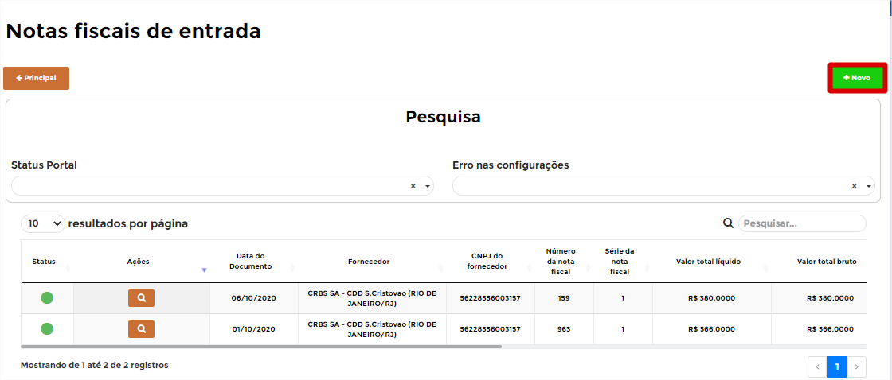

!!! Legenda

	=== "Status"
		**:fontawesome-solid-circle:{ .laranja } - Aguardando ciência**: Esse **Status** quer dizer que a **==Nota Fiscal de Entrada==** está aguardando para ser realizado a **ciência da operação** (manifesto) ou a **não ciência da operação**.

		**:fontawesome-solid-circle:{ .vermelho } - Documento mal informado**: Esse **Status** quer dizer que o **Fornecedor não existe** no *SAP Business One* ou **não existe o De Para de Itens** para esse Fornecedor, basta passar o mouse no **Status** que irá te apresentar.

		**:fontawesome-solid-circle:{ .laranja } - Documento aguardando envio**: Esse **Status** quer dizer o Fornecedor e De Para estão corretos, basta realizar as modificações do documento para depois enviar para o *SAP Business One*.

		**:fontawesome-solid-circle:{ .preto } - Aguardando retorno do ERP**: Esse **Status** quer dizer que a **==Nota Fiscal de Entrada==** está na fila para integração no *SAP Business One*.

		**:fontawesome-solid-circle:{ .verde } - Finalizado**: Esse **Status** quer dizer que foi criado uma **==Nota Fiscal de Entrada==** no *SAP Business One* (pode ser um esboço também, depende da sua **configuração**).

		**:fontawesome-solid-circle:{ .vermelho } - Erro**: Esse **Status** quer dizer que o *SAP Business One* gerou algum erro, para saber qual é basta passar o mouse encima do **Status**.

Para conseguir criar basta clicar em **Novo** e na próxima tela é necessário informar os campos necessários.

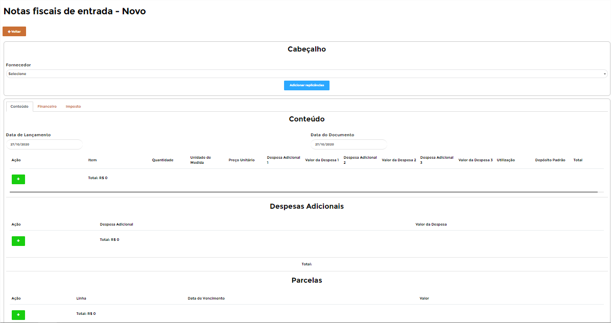

Segue as informações dos campos:

=== "Cabeçalho"

	*	**Fornecedor**: Informar o fornecedor que está fazendo o pedido de compra.
	*	**Data de Entrega**: Informar a data que o fornecedor irá entregar os produtos.

=== "Conteúdo"

	*	**Data de Lançamento**: Informar a Data de Lançamento do documento (data que irá contabilizar).
	*	**Data de Documento**: Informar a Data do Documento.
	=== "Linhas"
		*	**Ação**: Excluir a linha.
		*	**Item**: Informar o item/despesa que realizou a compra.
		*	**Quantidade**: Informar a quantidade comprada (lembrando da conversão de medida).
		*	**Unidade de Medida**: Informar a unidade de medida (Conversão de Caixa 12 UN (CX12UN).
		*	**Preço Unitário**: Informar o preço unitário do item/despesa conforme acordado com fornecedor.
		*	**Despesa Adicional**: Informação para documentos da SEFAZ (questões de impostos), portanto se for manual não precisa preencher.
		*	**Valor da Despesa**: Informação para documentos da SEFAZ (questões de impostos), portanto se for manual não precisa preencher.
		*	**Utilização**: Informar a utilização dessa compra.
		*	**Depósito Padrão**: Informar o depósito dessa compra (se for item que controla estoque, essa informação é importante).
		*	**Total**: Valor total do item ((Quantidade*PreçoUnitário) + Despesas Adicionais).
	=== "Despesas Adicionais"
		*	**Ação**: Excluir a linha.
		*	**Despesa Adicional**: Informar a Despesa adicional do documento (frete por exemplo).
		*	**Valor da Despesa**: Informar o valor da despesa adicional do documento.
	=== "Parcelas"
		*	**Ação**: Excluir a linha.
		*	**Linha**: B1Food irá trazer os números automáticos.
		*	**Data de Vencimento**: Informar a data do vencimento da parcela.
		*	**Valor**: Informar o valor da parcela.
		!!! warning "Parcelas"
			O Valor **total das parcelas** precisa ser o mesmo do **total do documento**.

=== "Financeiro"

	*	**Forma de Pagamento**: Informar a forma de pagamento do documento.

=== "Imposto"

	*	**Modelo**: Informar o modelo do documento
	*	**Série NF-e**: Informar o número de série do documento (se não for um documento fiscal pode colocar 1).
	*	**Número NF-e**: Informar o número de NF-e do documento (se não for um documento fiscal pode colocar AAAAMMDD (20210101)).

Para finalizar a **==Nota Fiscal de Entrada==** é possível informar uma **Observação** para detalhar alguma informação ou até mesmo **Anexar** algum documento. Depois disso basta clicar em **Salvar**.

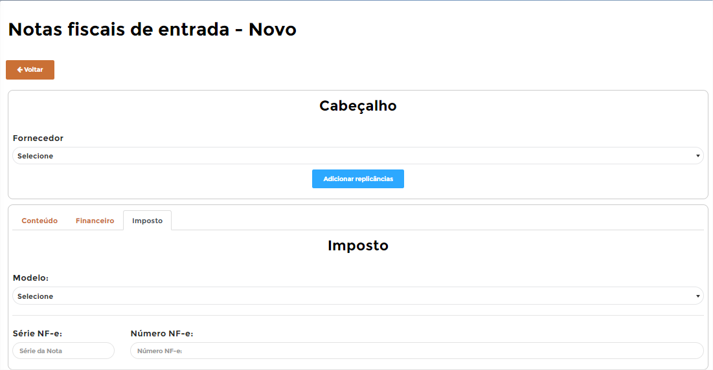

Pode acontecer de esquecer de preencher algum campo, com isso o B1Food irá apresentar uma mensagem de erro, segue exemplo:

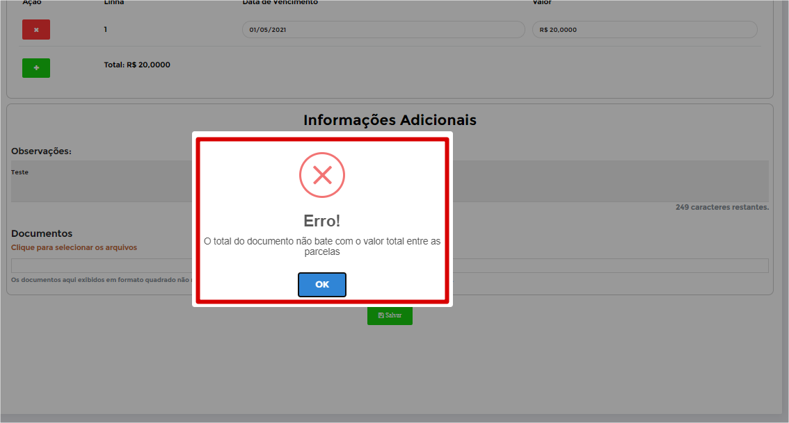

Caso a **==Nota Fiscal de Entrada==** estiver certo irá aparecer uma mensagem de **Sucesso - Requisição concluída com sucesso" e será necessário clicar no botão **Voltar** para ir na página inicial do **==Nota Fiscal de Entrada==**.

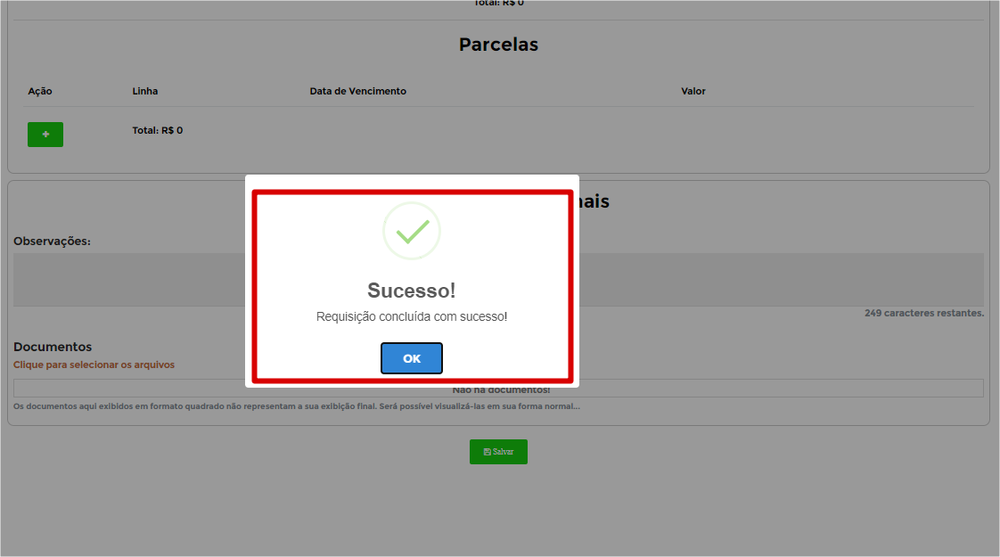

Será listada a **==Nota Fiscal de Entrada==** que acabou de criar e com isso será listado 4 ações para essa **==Nota Fiscal de Entrada==**, segue abaixo explicativo de cada uma delas.

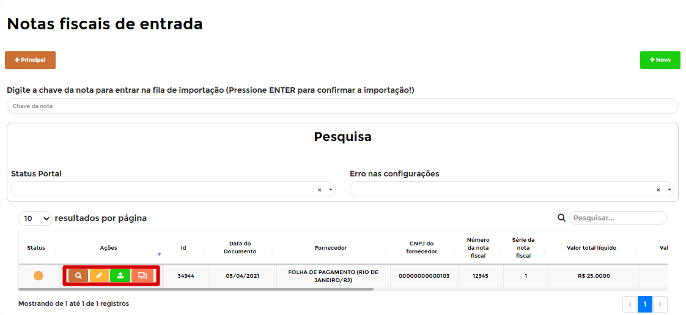

=== ":fontawesome-solid-search:{ .search }"
	*	A ação **Visualizar** irá abrir a **==Nota Fiscal de Entrada==** para poder avaliar algum item, por exemplo. 
	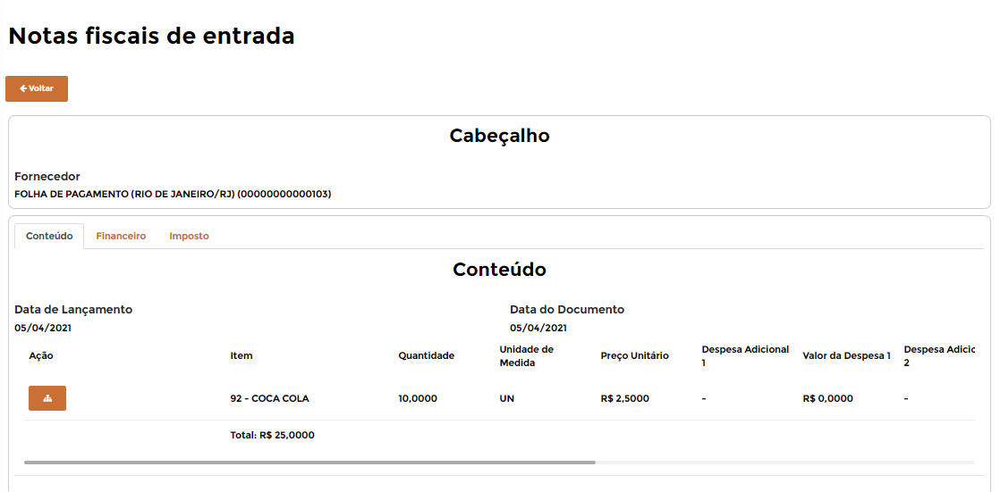{ align=left }

=== ":fontawesome-solid-pen-square:{ .pen }"
	*	A ação **Editar** irá abrir a **==Nota Fiscal de Entrada==** para realizar alguma edição.
	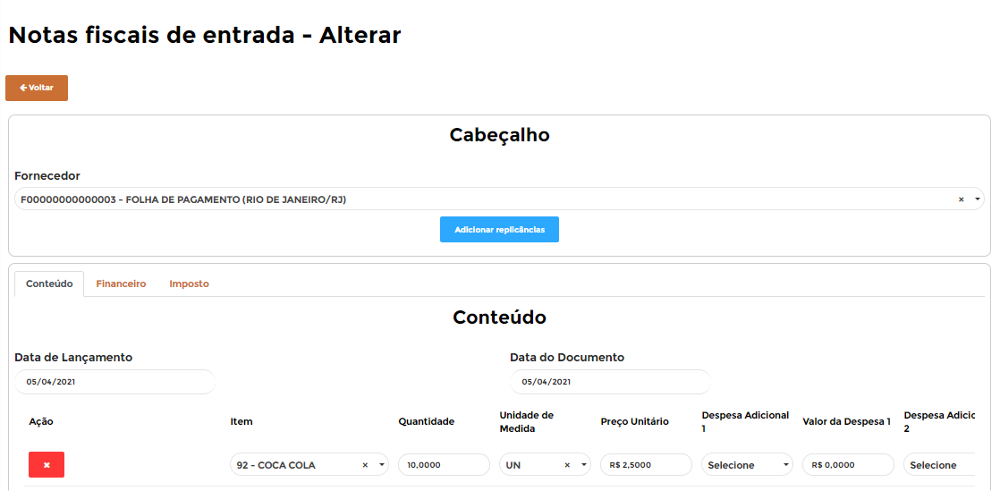{ align=left }

=== ":fontawesome-solid-upload:{ .check }"
	*	A ação **Enviar** irá enviar para o *SAP Business One* a criação dessa **==Nota Fiscal de Entrada==**.
	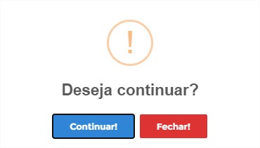{ align=left }

=== ":fontawesome-solid-object-ungroup:{ .marrom }"
	*	A ação **Refazer de-para de itens** é apenas para documentos da **SEFAZ**.

Se você enviou a **==Nota Fiscal de Entrada==** ela entrou em uma **aprovação**, pode ser que você que faça ela ou outro usuário, mas irei explicar como realizar essa aprovação.

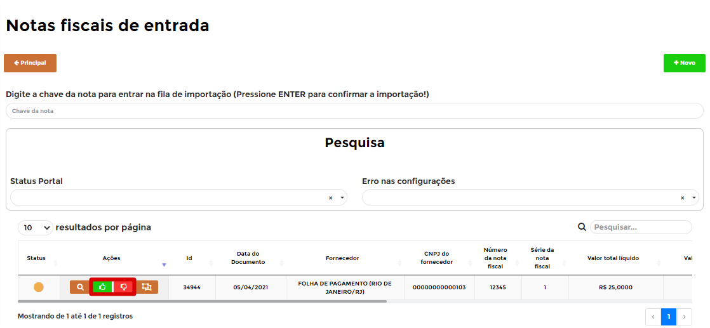

=== ":fontawesome-solid-thumbs-up:{ .aprovar }"
	*	A ação **Aprovar** irá enviar para o *SAP Business One* a criação dessa **==Nota Fiscal de Entrada==**.
	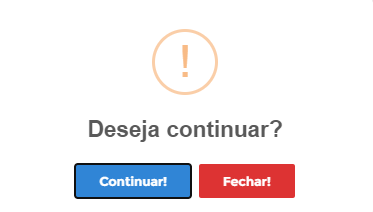{ align=left }

=== ":fontawesome-solid-thumbs-down:{ .rejeitar }"
	*	A ação **Rejeitar** será necessário informar o **Motivo** que rejeitou, para que o usuário que fez saiba e consiga realizar as devidas alterações para reenviar novamente.
	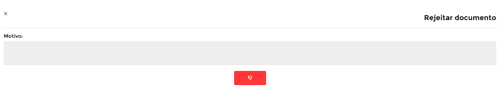

Caso a **==Nota Fiscal de Entrada==** for aprovado, ele irá entrar para fila de envio para o *SAP Business One*, durante esse processo o **Status** ficará :fontawesome-solid-circle:{ .preto }, caso der tudo certo o **Status** irá ficar :fontawesome-solid-circle:{ .verde } e se der algum erro ao integrar com o *SAP Business One* o **Status** irá ficar :fontawesome-solid-circle:{ .vermelho } e irá apresentar o erro.

---

## **NF-e - SEFAZ**

A **==Nota fiscal de Entrada - SEFAZ==** são os lançamentos de documentos que possuem XML, portanto o B1Food realiza as consultas direto no ambiente da SEFAZ, onde será criado no *SAP Business One* uma **Nota Fiscal de Entrada**.

Na tela inicial da **==Nota fiscal de Entrada - SEFAZ==** é possível consultar todas que já foram criadas e qual o **Status** de cada uma delas.

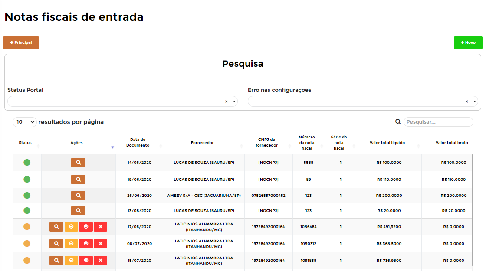

!!! Legenda

	=== "Status"
		**:fontawesome-solid-circle:{ .laranja } - Aguardando ciência**: Esse **Status** quer dizer que a **==Nota Fiscal de Entrada==** está aguardando para ser realizada a **ciência da operação** (manifesto) ou a **não ciência da operação**.

		**:fontawesome-solid-circle:{ .vermelho } - Documento mal informado**: Esse **Status** quer dizer que o **Fornecedor não existe** no *SAP Business One* ou **não existe o De Para de Itens** para esse Fornecedor, basta posicionar o cursor em cima do **Status** que irá te apresentar.

		**:fontawesome-solid-circle:{ .laranja } - Documento aguardando envio**: Esse **Status** quer dizer o Fornecedor e De Para estão corretos, basta realizar as modificações do documento para depois enviar para o *SAP Business One*.

		**:fontawesome-solid-circle:{ .preto } - Aguardando retorno do ERP**: Esse **Status** quer dizer que a **==Nota Fiscal de Entrada==** está na fila para integração no *SAP Business One*.

		**:fontawesome-solid-circle:{ .verde } - Finalizado**: Esse **Status** quer dizer que foi criado uma **==Nota Fiscal de Entrada==** no *SAP Business One* (pode ser um esboço também, depende da sua **configuração**).

		**:fontawesome-solid-circle:{ .vermelho } - Erro**: Esse **Status** quer dizer que o *SAP Business One* gerou algum erro, para saber qual é basta posicionar o cursor em cima do **Status**.

Ao listar as **==Notas Fiscal de Entrada==** que foram emitidas conta a filial, é necessário realizar o **Manifesto do Documento (Ciência da Operação)** caso você confirme esse documento ou a **Não Manifesto do Documento (Desconhecimento da operação)** caso desconheça esse documento. 
	
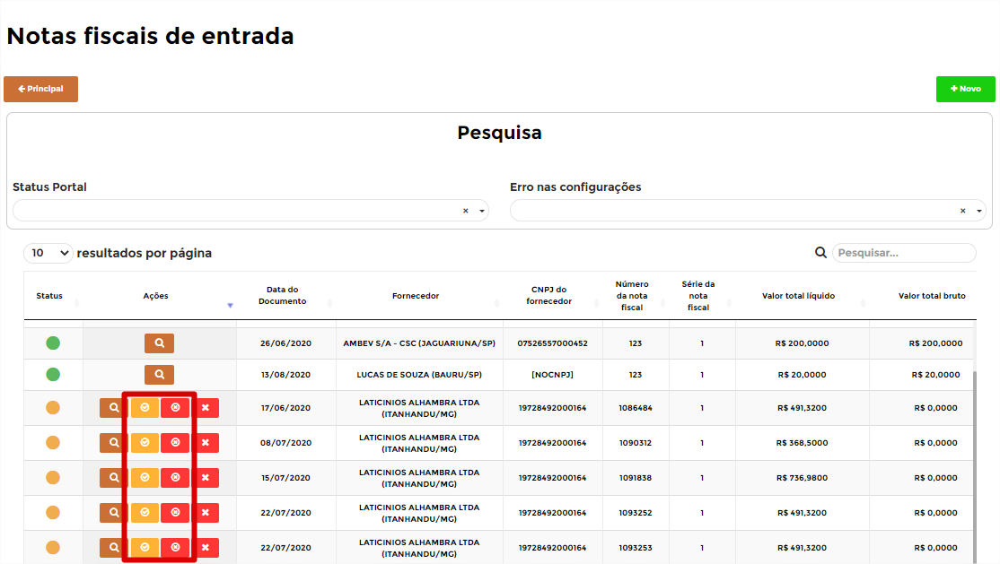

=== ":fontawesome-solid-check-circle:{ .check_aprovar }"
	*	A ação **Manifestar Documento** irá informar a SEFAZ que a empresa reconhece a compra e depois disso que a SEFAZ libera o XML com todas as informações.
	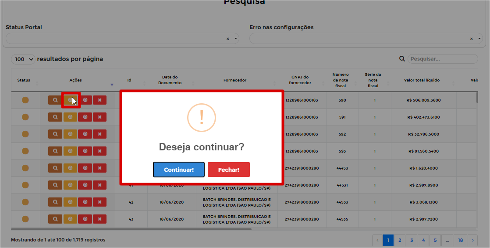{ align=left }

=== ":fontawesome-solid-times-circle:{ .rejeitar }"
	*	A ação **Não Manifestar Documento** irá informar a SEFAZ que não reconhece a compra.
	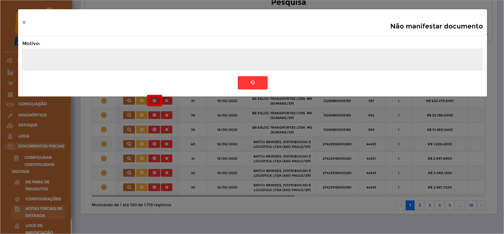

Após realizar essa ação, é necessário aguardar a **SEFAZ retornar** para o B1Food os dados detalhados do documento (XML), portanto o documento 
irá ficar com o **Status de Documento aguardando ciência** :fontawesome-solid-circle:{ .laranja }.

!!! warning "Retorno"
	Não existe um prazo definido, mas esse processo geralmente é rápido

Quando o documento estiver com a ciência, a próxima etapa é a verificação do B1Food se o Fornecedor existe no *SAP Business One* (essa verificação é pelo CNPJ), caso não existe irá ficar com o **Status de Documento mal Informado – Fornecedor não encontrado no Sistema** :fontawesome-solid-circle:{ .vermelho }.

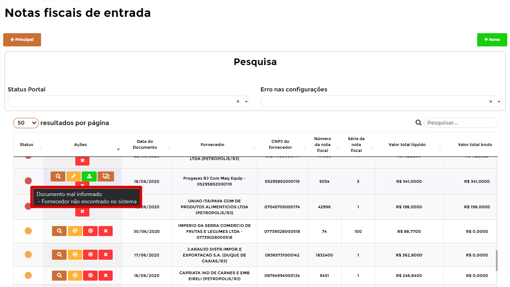

Portanto, é necessário **cadastrar o fornecedor** no *SAP Business One* e aguardar a integração enviar os dados para o B1Food. 
Com os dados no B1Food, é necessário fazer a **verificação do documento** (pois a verificação da existência do fornecedor é automática na primeira vez apenas), para isso clique no botão **Visualizar registro**.

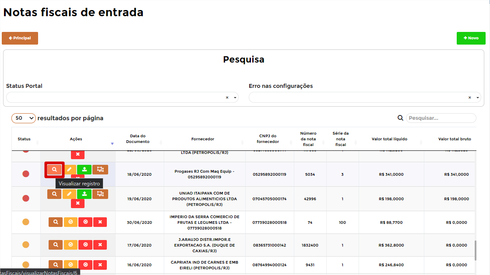

Para essa verificação é necessário clicar no **botão Verificar fornecedor**, com isso o **B1Food irá fazer análise** se o fornecedor existe na base.

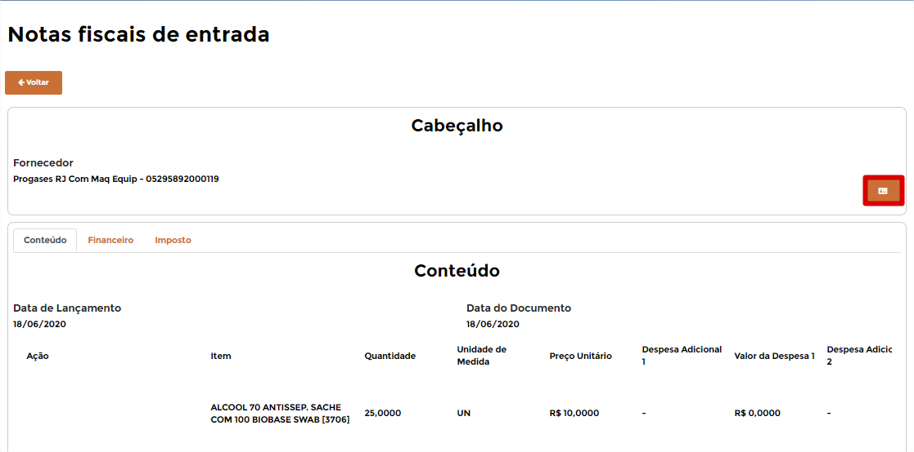

Caso ele encontrou o fornecedor, a próxima verificação do B1Food é se existe **DE PARA para esse Fornecedor/Itens**, e caso não exista esse DE PARA, o Status ficará **Documento mal Informado – Itens não encontrados no de-para de produtos no catálogo do fornecedor**.

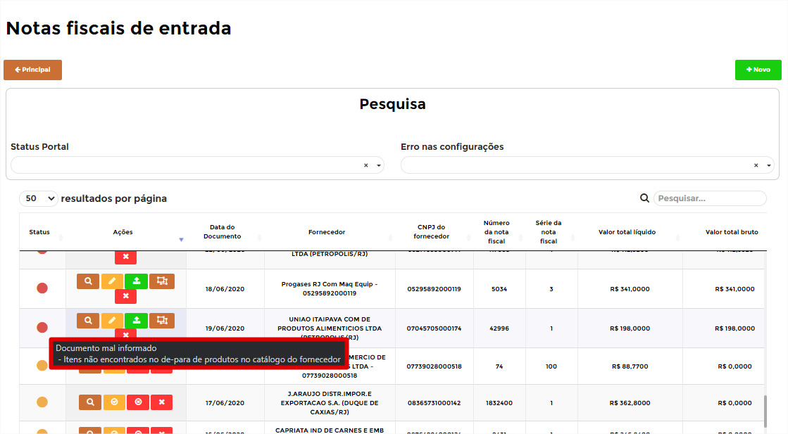

Para criar esse DE PARA dos itens que não possuem é necessário clicar no botão **Visualizar registro**.

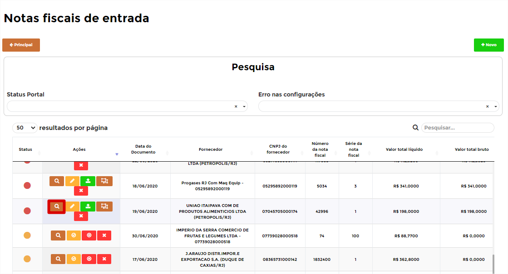

Ao abrir o documento, será listado os **itens desse da Nota Fiscal** e caso o item não tiver DE PARA terá o botão para **criação do DE PARA**.

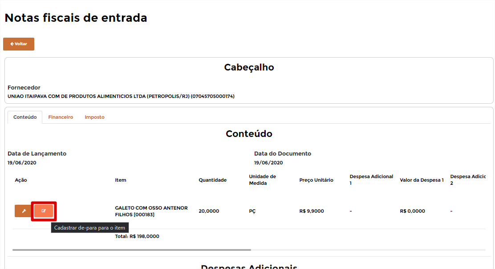

Para esse cadastro será necessário escolher qual o produto do *SAP Business One* equivale a esse produto do fornecedor e mais algumas informações. Após isso basta clicar em **Salvar**.

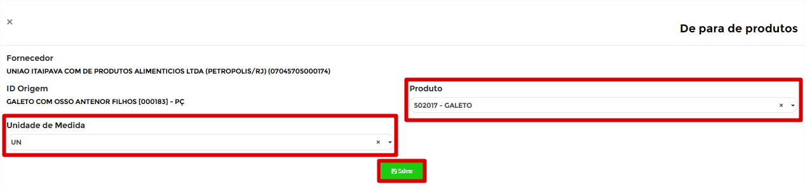

Segue as informações dos campos:

=== "Campos"

	*	**Fornecedor**: B1Food irá trazer automaticamente o Nome do Fornecedor.
	*	**ID Origem**: B1Food irá trazer automaticamente o código do item do seu fornecedor.
	*	**Produto**: Informar qual o item do *SAP Business One* que é equivalente.
	*	**Unidade de Medida**: Informar a Unidade de Medida que geralmente compra desse fornecedor (para o item informado).

!!! warning "Itens"
	É necessário realizar esse processo com todos os itens do documento, até não ter mais nenhum item para realizar o DE PARA.

Com o **fornecedor existente** e **de para de itens criados**, é necessário **editar os documentos** com algumas informações necessárias, para isso clique no botão **Alterar registro**.

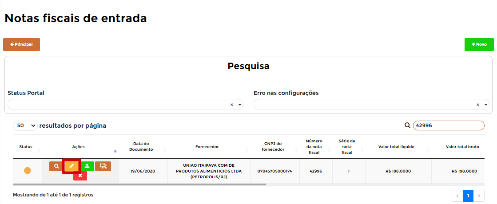

Para alterar todas as informações dos itens (caso for a mesma informação) pode ser usado o botão **Adicionar replicâncias**, isso irá facilitar o preenchimento.

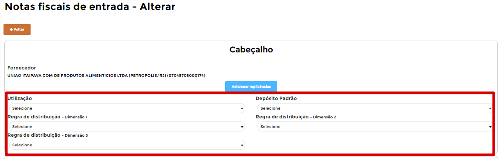

Segue as informações dos campos:

=== "Cabeçalho"

	*	**Fornecedor**: B1Food irá trazer automaticamente o Fornecedor da NF-e.

=== "Conteúdo"

	*	**Data de Lançamento**: Informar a Data de Lançamento do documento (data que irá contabilizar).
	*	**Data de Documento**: B1Food irá trazer automaticamente a Data de emissão da NF-e.
	=== "Linhas"
		*	**Ação**: Excluir a linha.
		*	**Item**: B1Food irá trazer o item do DE PARA.
		*	**Quantidade**: B1Food irá trazer a quantidade da NF-e.
		*	**Unidade de Medida**: B1Food irá trazer a Unidade de Medida do DE PARA, mas é possível ajustar caso necessário.
		*	**Preço Unitário**: B1Food irá trazer preço unitário da NF-e.
		*	**Despesa Adicional**: B1Food irá trazer o tipo das despesas **caso tiver** (nas linhas podem ser IPI, FCP, ICMS-ST, OUTROS).
		*	**Valor da Despesa**: B1Food irá trazer o valor das despesas **caso tiver** (nas linhas podem ser IPI, FCP, ICMS-ST, OUTROS).
		*	**Utilização**: Informar a utilização dessa compra (motivo da compra).
		*	**Depósito Padrão**: Informar o depósito dessa compra (se for item que controla estoque, essa informação é importante).
		*	**Total**: Valor total do item ((Quantidade*PreçoUnitário) + Despesas Adicionais).

	=== "Despesas Adicionais"
		*	**Ação**: Excluir a linha.
		*	**Despesa Adicional**: B1Food irá trazer o tipo das despesas **caso tiver** (são valores que serão quebrados depois por itens, como frente e seguro).
		*	**Valor da Despesa**: B1Food irá trazer o valor das despesas **caso tiver** (são valores que serão quebrados depois por itens, como frente e seguro).

=== "Financeiro"

	*	**Forma de Pagamento**: Informar a forma de pagamento do documento.

=== "Imposto"

	*	**Modelo**: B1Food irá trazer o NF-e como padrão.
	*	**Série NF-e**: B1Food irá informar a série da NF-e.
	*	**Número NF-e**: B1Food irá informar o número da NF-e.

Sobre as parcelas, caso o **fornecedor informou** as parcelas na NF-e, elas serão preenchidas automaticamente e caso o **fornecedor não informar**, será obrigatório informar as parcelas manualmente.

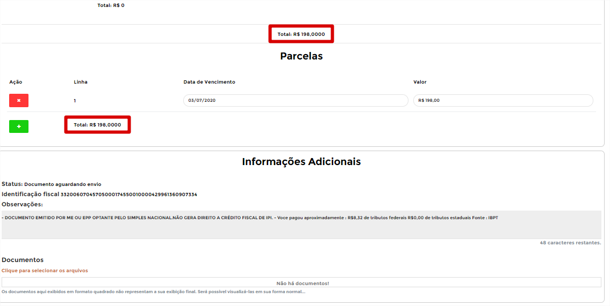

Segue as informações dos campos:

=== "Conteúdo"

	=== "Parcelas"
		*	**Ação**: Excluir a linha.
		*	**Linha**: B1Food irá trazer os números automáticos.
		*	**Data de Vencimento**: Informar a data do vencimento da parcela.
		*	**Valor**: Informar o valor da parcela.
		!!! warning "Parcelas"
			O Valor **total das parcelas** precisa ser o mesmo do **total do documento**.

Para finalizar a **==Nota Fiscal de Entrada==** é possível informar uma **Obeservação** (irá vir automaticamente a mesma Observações da NF-e, mas é possível modificar) para detalhar alguma informação ou até mesmo **Anexar** (**Clique para Selecionar os arquivos**) algum documento. Depois disso basta clicar em **Salvar**.

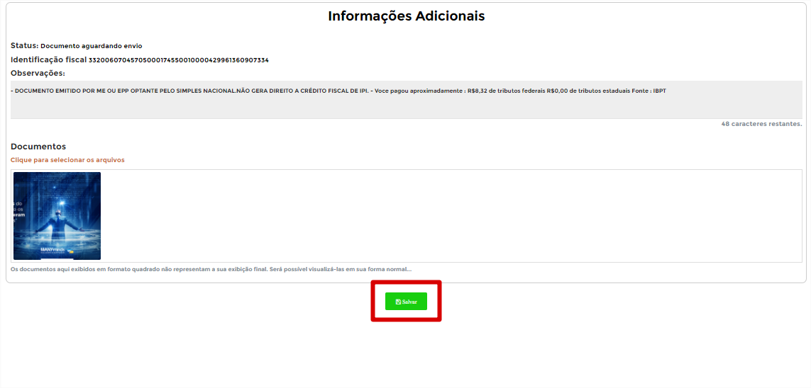

Pode acontecer de esquecer de preencher algum campo, com isso o B1Food irá apresentar uma mensagem de erro, segue exemplo.


Caso a **==Nota Fiscal de Entrada==** estiver certa irá aparecer uma mensagem de **Sucesso - Requisição concluída com sucesso** e será necessário clicar no botão **Voltar** para ir à página inicial do **==Nota Fiscal de Entrada==**.


Será listado a **==Nota Fiscal de Entrada==** que acabou de ser criada e com isso será listado 4 ações para essa **==Nota Fiscal de Entrada==**, segue abaixo explicativo de cada uma delas.


=== ":fontawesome-solid-search:{ .search }"
	*	A ação **Visualizar** irá abrir a **==Nota Fiscal de Entrada==** para poder avaliar algum item por exemplo. 
	{ align=left }

=== ":fontawesome-solid-pen-square:{ .pen }"
	*	A ação **Editar** irá abrir a **==Nota Fiscal de Entrada==** para realizar alguma edição.
	{ align=left }

=== ":fontawesome-solid-upload:{ .check }"
	*	A ação **Enviar** irá enviar para o *SAP Business One* a criação dessa **==Nota Fiscal de Entrada==**.
	{ align=left }

=== ":fontawesome-solid-object-ungroup:{ .marrom }"
	*	A ação **Refazer de-para de itens** é apenas para documentos da **SEFAZ**.

Se você enviou a **==Nota Fiscal de Entrada==** ela entrou em uma **aprovação**, pode ser que você que faça ela ou outro usuário, mas irei explicar como realizar essa aprovação.


=== ":fontawesome-solid-thumbs-up:{ .aprovar }"
	*	A ação **Aprovar** irá enviar para o *SAP Business One* a criação dessa **==Nota Fiscal de Entrada==**.
	{ align=left }

=== ":fontawesome-solid-thumbs-down:{ .rejeitar }"
	*	A ação **Rejeitar** será necessário informar o **Motivo** que rejeitou, para que o usuário que fez saiba e consiga realizar as devidas alterações para reenviar novamente.
	

Caso a **==Nota Fiscal de Entrada==** for aprovado, ela irá entrar para fila de envio para o *SAP Business One*, durante esse processo o **Status** ficará :fontawesome-solid-circle:{ .preto }, caso der tudo certo o **Status** irá ficar :fontawesome-solid-circle:{ .verde } e se der algum erro ao integrar com o *SAP Business One* o **Status** irá ficar :fontawesome-solid-circle:{ .vermelho } e irá apresentar o erro.