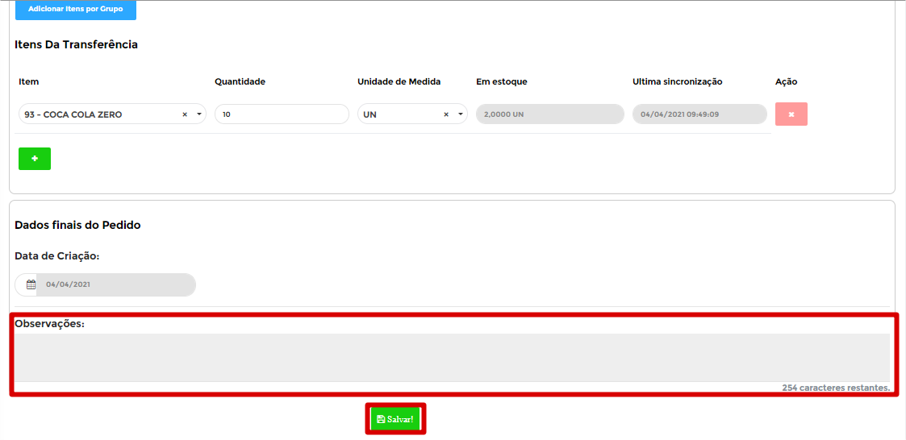
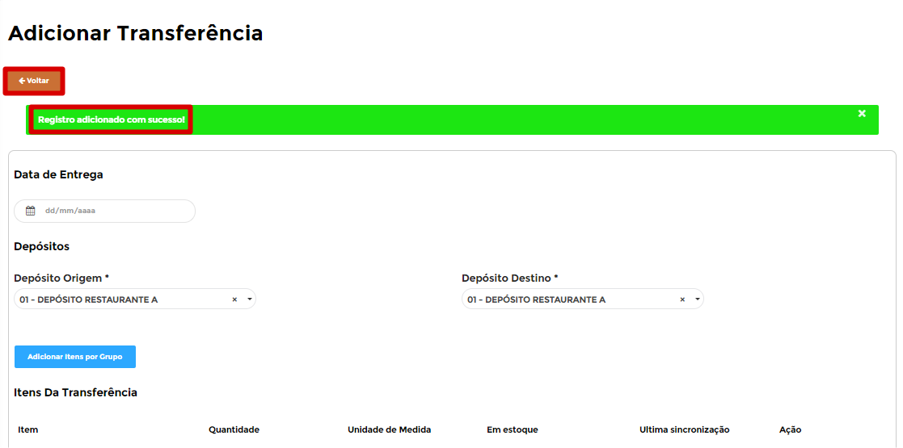

# **Apontamento de Perdas**

***```
Menu: Estoque -> Apontamento de Perdas
```***

---

O **==Apontamento de perdas==** é uma saída de estoque sem uma origem de venda, caso o produto foi danificado e precisa dar a baixa do estoque, 
sendo possível informar um insumo direto ou até a ficha técnica.

Na tela inicial do **==Apontamento de perdas==** é possível ver todos que já foram criados e qual o **Status** de cada uma deles.


!!! Legenda

	=== "Status"
		**:fontawesome-solid-circle:{ .preto } - Apontamento aguardando confirmação do ERP**: Esse **Status** quer dizer que o **==Apontamento de Perda==** está na fila para integração no *SAP Business One*.

		**:fontawesome-solid-circle:{ .azul_status } - Apontamento inserido com sucesso**: Esse **Status** quer dizer que o **==Apontamento de Perda==** entrou no *SAP Business One* e está aguardando criar um Apontamento de Perda a partir dela.

		**:fontawesome-solid-circle:{ .vermelho } - Erro**: Esse **Status** quer dizer que o *SAP Business One* gerou algum erro, para saber qual é basta posicionar o cursor em cima do **Status**.

Para criar um **==Apontamento de perdas==** basta clicar no botão **Novo Apontamento**.


Uma nova página será aberta automaticamente, nessa tela é possível inserir os itens **Unitários** ou inserir os itens por **Grupo de Itens**, irei demonstrar para vocês as duas maneiras.

Vamos começar por **Grupo de Itens**, para isso basta clicar no botão **Adicionar Itens por Grupo** e será listado todos os grupos de itens cadastrados no *SAP Business One*.

Após listar todos os **Grupos de Itens**, é necessário selecionar apenas 1x, basta clicar 1x no grupo desejado.


Será listado todos os itens de Compras daquele Grupo selecionado, portanto basta preencher os campos dos itens que você deseja e clicar em **Incluir Produtos**.


!!! warning "Apontamento de Perdas"
    Lembrando que **não precisa ser todos os itens**, apenas os itens que você precisa.

Segue as informações dos campos:

=== "Campos"

	*	**Quantidade**: Informar a quantidade que deseja comprar, lembrando que não é quantidade total dos itens (caso utilize conversões de medida).

Depois da última etapa, será retornado para página inicial do **==Apontamento de Perdas==** e perceba que os itens que selecionou no grupo estão preenchidos nas linhas. Esse processo pode ser realizado **quantas vezes for necessário**, depende dos grupos que vocês possuem. 

Caso inseriu um item errado, basta clicar no :fontawesome-regular-window-close:{ .close } ao final da linha do item, isso irá excluir aquela linha do Apontamento de Perdas.


Para inserir os itens **Unitários**, basta clicar em **Item** e procurar o produto que deseja, pode ser por nome ou pelo código. Caso queira adicionar novos itens, clique no + que irá carregar uma nova linha automaticamente.


Segue informações dos campos:

=== "Cabeçalho"

	*	**Data do Documento**: Informar a data que foi realizado a perda.
	*	**Descrição da Perda**: Informar o motivo da perda para fins históricos.

=== "Linhas"

	*	**Item**: Informar o item que deseja solicitar.
	*	**Regras de distribuição**: Informar os centros de custos liberado para seu acesso, se tiver 3 dimensões liberadas, terá 3 campos de regras de distribuição.
	*	**Quantidade**: Informar a quantidade total que foi perdido.
	*	**Ação**: Excluir a linha.

Para finalizar a **==Apontamento de Perdas==** é possível informar uma **Observação** para detalhar alguma informação e depois disso basta clicar em **Salvar**.



Pode acontecer de esquecer de preencher algum campo, com isso o B1Food irá apresentar uma **mensagem de erro**, segue exemplo.


Caso o **==Apontamento de Perdas==** estiver certo irá aparecer uma mensagem de **Registro adicionado com sucesso" e será necessário clicar no botão **Voltar** para ir à página inicial do **==Apontamento de Perdas==**.



O **==Apontamento de Perdas==** irá entrar para fila de envio para o *SAP Business One*, durante esse processo o **Status** ficará :fontawesome-solid-circle:{ .preto }, caso der tudo certo o **Status** irá ficar :fontawesome-solid-circle:{ .verde } e se der algum erro ao integrar com o *SAP Business One* o **Status** irá ficar :fontawesome-solid-circle:{ .vermelho } e irá apresentar o erro.