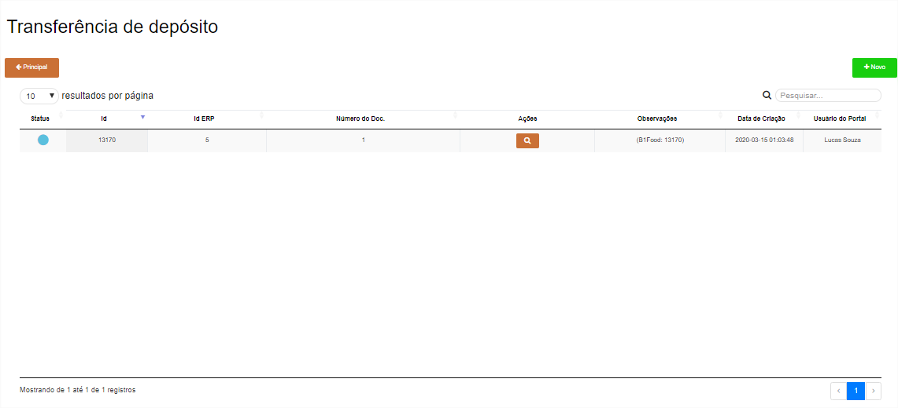
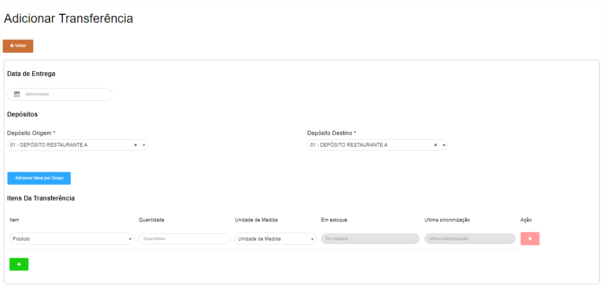
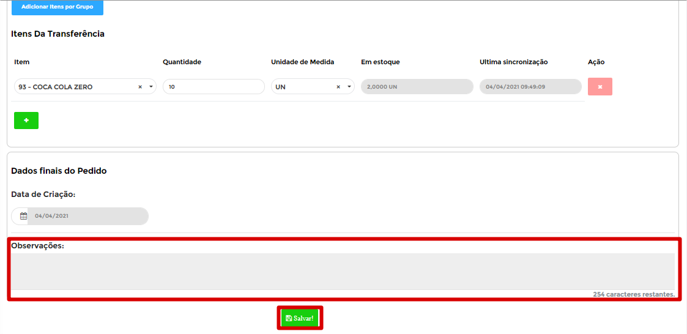
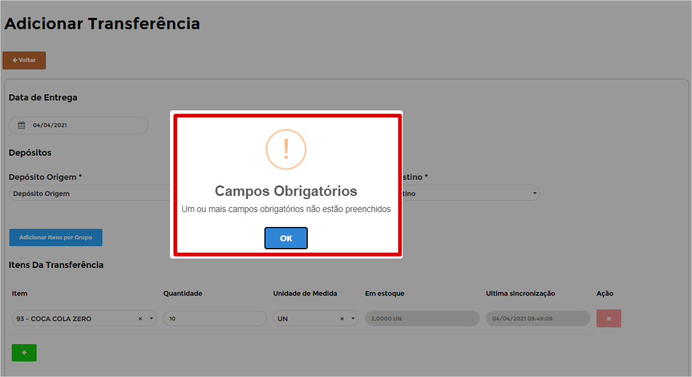
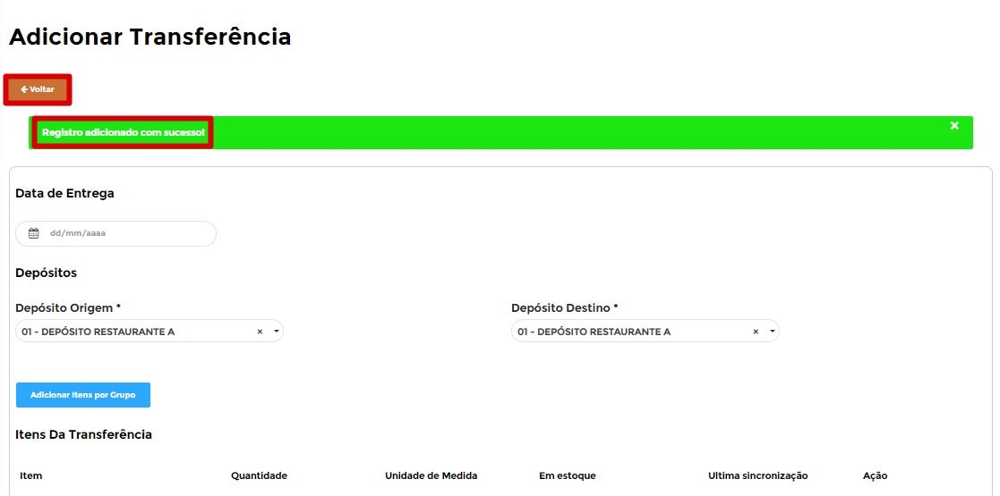

# **Transferência de Depósito**

***```
Menu: Estoque -> Transferência de Depósito
```***
---

A **Transferência de depósito** será utilizada quando existe mais de uma localização física para **mesma filial (CNPJ)**, exemplo: 
Na FILIAL A existe o depósito **CENTRAL**, **BAR** e **COZINHA**.

Na tela inicial da **`Transferência de depósito`** é possível ver todas que já foram criadas e qual o **Status** de cada uma delas.



!!! Legenda

	=== "Status"
		**:fontawesome-solid-circle:{ .preto } - Transferência aguardando confirmação do ERP**: Esse **Status** quer dizer que a **==Transferência==** está na fila para integração no *SAP Business One*.

		**:fontawesome-solid-circle:{ .verde } - Transferência Finalizada**: Esse **Status** quer dizer que a **==Transferência==** entrou no *SAP Business One*.

		**:fontawesome-solid-circle:{ .vermelho } - Erro**: Esse **Status** quer dizer que o *SAP Business One* gerou algum erro, para saber qual é basta posicionar o cursor em cima do  **Status**.

Para conseguir criar uma, basta clicar em “Novo” e na próxima tela é necessário realizar o preenchimento dos campos.



Segue as informações dos campos:

=== "Cabeçalho"

	*	**Data de Entrega**: Informar a data que foi realizado a transferência.
	*	**Depósito Origem**: Informar o depósito que o produto irá sair.
	*	**Depósito Destino**: Informar o depósito que o produto irá entrar.

=== "Linhas"

	*	**Item**: Informar o item que deseja transferir.
	*	**Quantidade**: Informar a quantidade total que será transferido.
	*	**Unidade de Medida**: Informar a unidade de medida padrão de estoque (UN, KG, LT ...).
	*	**Em Estoque**: Se estiver com a configuração marcada, irá aparecer esse campo informando a quantidade desse item no estoque de origem.
	*	**Última sincronização**: Se estiver com a configuração marcada, irá aparecer quando foi feito a consulta do estoque no *SAP Business One*.
	*	**Ação**: Excluir a linha.

Para finalizar a **==Transferência de depósito==** é possível informar uma **Observação** para detalhar alguma informação e depois disso basta clicar em **Salvar**.



Pode acontecer de esquecer de preencher algum campo, com isso o B1Food irá apresentar uma **mensagem de erro**, segue exemplo.



Caso a **==Transferência de depósito==** estiver certa irá aparecer uma mensagem de **Registro adicionado com sucesso** e será necessário clicar no botão **Voltar** para ir à página inicial da **==Transferência de depósito==**.



A **==Transferência de depósito==** irá entrar para fila de envio para o *SAP Business One*, durante esse processo o **Status** ficará :fontawesome-solid-circle:{ .preto }, caso der tudo certo o **Status** irá ficar :fontawesome-solid-circle:{ .verde } e se der algum erro ao integrar com o *SAP Business One* o **Status** irá ficar :fontawesome-solid-circle:{ .vermelho } e irá apresentar o erro.