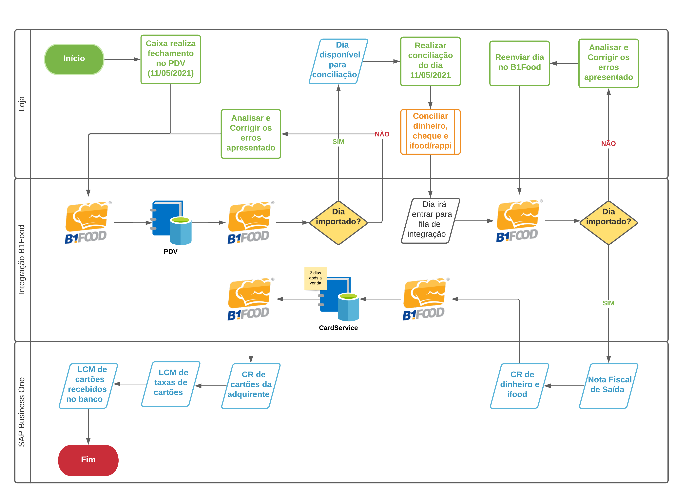

# **CardService**

---

A Integração do **==CardService==** com o B1Food é utilizada para **facilitar** os dados do que foi vendido de cartões de crédito/débito/benefício e oque foi recebido de cartões de crédito/débito/benefício, buscando os dados **diretamenta da adquirente** (Cielo, Rede, Stone, Getnet, etc).

Segue o **fluxo de processo** quando existe a integração do **==CardService==**.

Detalhamento do processo:

-	O Processo se inicia com o **caixa realizando o fechamento do dia no PDV**, portanto após o fechamento, o **PDV** irá disponibilizar essas vendas na nuvem para o **B1Food** realizar a captura dos dados. Essa captura dos dados acontece sempre no dia seguinte as 7h da manhã.

-	No momento da captura dos dados o **B1Food** realiza algumas validações (cadastro de operador de caixa e terminal (dependendo do seu PDV)) e caso tudo estiver correto o **dia irá ficar disponível** para conciliação no B1Food, caso **não estiver disponível** é possível verificar o motivo no **Log de Importações do B1Food**.

-	Com o dia disponível no **B1Food**, é necessário **realizar a conciliação do dia** informando se teve **movimentações de caixa** (saída de dinheiro), **conciliar os valores das formas de pagamentos** que não irão vir do CardService (dinheiro, cheque, ifood, rappi, Uber Eats, etc) e após a **finalização da conciliação** o dia irá automaticamente entrar na **fila de integração para o SAP Business One**. 

	* Lembrando que as **formas de pagamentos de cartões** que irão vir do CardService estarão **bloqueadas** no momento da conciliação, pois **aqueles valores são do PDV** e o **B1Food não irá considerar esses valores**.

-	Nesse primeiro momento o **B1Food** irá criar uma **Nota Fiscal de Saída** com os itens vendidos, gerando a receita (**não é um documento fiscal, apenas gerencial**) e a **baixa de estoque** (podendo também não baixar estoque, dependendo da configuração utilizada) e depois irá criar um **Contas à Receber dos valores conciliados na etapa anterior**, como dinheiro, cheque, ifood, rappi (se houve valor na conciliação). Nesse momento **alguns erros podem surgir na integração**, os mais comuns são: itens não cadastrados, falta de estoque, falta de impostos, portanto é **necessário o usuário realizar esse ajustes** e reenviar o dia para entrar na fila da integração novamente'.

-	Após a venda importada no SAP Business One, existe um **tempo médio de 2 dias após a data da venda** para toda informação estar no CardService. Exemplo: Vendas do dia 01/05/2021 serão conciliadas no B1Food no dia 02/05/2021, mas as **informações do CardService só estarão disponíveis no dia 03/05/2021** e o B1Food realiza a importação do CardService para o SAP Business One automaticamente, após esse prazo (se o dia já estiver conciliado). 

-	Nesse último momento o **B1Food irá criar um Contas à Receber** no dia da venda (01/05/2021) com os cartões vendidos informados pelo CardService, irá criar o **lançamento das taxas de cartões (despesas)** (01/05/2021) e os **cartões que foram recebidos contra banco** (01/05/2021).

*[PDV]: Ponto de Venda