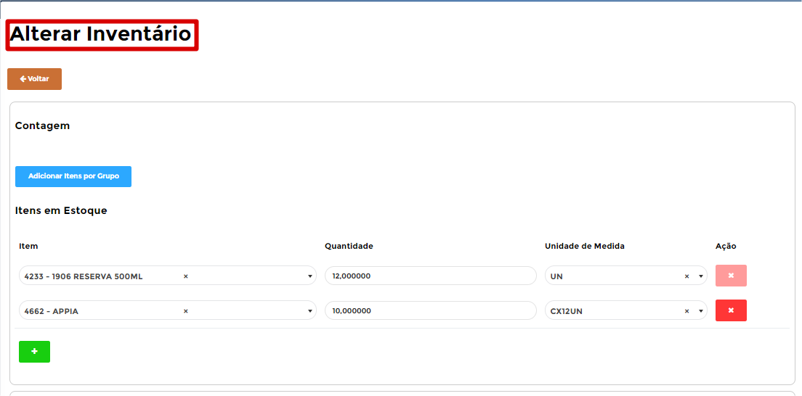

# **Inventário**

***```
Menu: Inventário
```***

---

O Módulo de **==Inventário==** é integrada ao *SAP Business One* e quem irá utilizar é a equipe da loja, pois esse módulo é para criação de uma contagem de estoque, onde ela pode ser feita diária, semanal ou mensal, depende do processo definido pela empresa.

Na tela inicial do **==Inventário==** é possível ver todas que já foram criadas e qual o **Status** de cada uma delas.


!!! Legenda

	=== "Status"
		**:fontawesome-solid-circle:{ .azul_status } - Contagem em Andamento**: Esse **Status** quer dizer que o **==Inventário==** está aguardando para ser enviada para entrar na fila da integração com *SAP Business One*.

		**:fontawesome-solid-circle:{ .preto } - Aguardando integração**: Esse **Status** quer dizer que o **==Inventário==** está na fila para integração no *SAP Business One*.

		**:fontawesome-solid-circle:{ .verde } - Contagem Finalizado**: Esse **Status** quer dizer que foi criado o **==Inventário==** no SAP Business One.

		**:fontawesome-solid-circle:{ .vermelho } - Erro**: Esse **Status** quer dizer que o *SAP Business One* gerou algum erro, para saber qual é basta posicionar o cursor em cima do **Status**.

Existe duas maneiras de criar um **==Inventário==**, segue cada um deles:

---

## **Contagem de Estoque - Manual**

Para conseguir criar uma nova, basta clicar em **Novo** e selecionar **Inventário Manual**.


Uma nova página será aberta automaticamente, nessa tela é possível inserir os itens **Unitários** ou inserir os itens por **Grupo de Itens**, irei demonstrar para vocês às duas maneiras.

Vamos começar por **Grupo de Itens**, para isso basta clicar no botão **Adicionar Itens por Grupo** e será listado todos os grupos de itens cadastrados no *SAP Business One*.


Após listar todos os **Grupos de Itens**, é necessário selecionar apenas 1x, basta clicar 1x no grupo desejado.

Será listado todos os itens de Compras daquele Grupo selecionado, portanto basta preencher os campos dos itens que você deseja e clicar em **Incluir Produtos**.


!!! warning "Inventário"
    Lembrando que **não precisa ser todos os itens**, apenas os itens que você precisa.

Segue as informações dos campos:

=== "Campos"
	*	**Quantidade**: Informar a quantidade que deseja comprar, lembrando que não é quantidade total dos itens (caso utilize conversões de medida).
	*	**Unidade de Medida**: Informar a Unidade de Medida (conversão), exemplo: Irá comprar uma Caixa com 12 Unidades, basta escolher CX12UN.

Depois da última etapa, será retornado para página inicial do **==Inventário==** e perceba que os itens que selecionou no grupo estão preenchidos nas linhas. Esse processo pode ser realizado **quantas vezes for necessário**, depende dos grupos que vocês possuem. 

Caso inseriu um item errado, basta clicar no :fontawesome-regular-window-close:{ .close } ao final da linha do item, isso irá excluir aquela linha do Inventário.


Para finalizar o **==Inventário==**, é necessário informar os dados do **rodapé do documento** e clicar em **Salvar**.


Segue as informações dos campos:

=== "Campos"
	*	**Depósito**: Será listado os depósitos da Filial do B1Food, portanto basta selecionar qual depósito seria essa contagem
	*	**Data de Criação**: Informar a data que foi realizada a contagem e não quando ela foi lançada
	*	**Observações**: Caso seja necessário informar uma observação para histórico.

Ao **Salvar**, a tela ficará sem os dados e será necessário clicar em **Voltar** para ir à página inicial do **==Inventário==**, onde deverá realizar a última etapa do processo.


Será listado o **==Inventário==** que acabou de criar e com isso será listado 4 ações para esse **==Inventário==**, segue abaixo explicativo de cada uma delas.


=== ":fontawesome-solid-search:{ .search }"
	*	A ação **Visualizar** irá abrir o **==Inventário==** para poder avaliar algum item, por exemplo.
	{ align=left }

=== ":fontawesome-solid-window-close:{ .close }"
	*	A ação **Excluir** irá apagar o **==Inventário==** criado.
	{ align=left }

=== ":fontawesome-solid-check-square:{ .check }"
	*	A ação **Enviar** irá enviar para o *SAP Business One* a criação desse **==Inventário==**.
	{ align=left }

=== ":fontawesome-solid-pen-square:{ .pen }"
	*	A ação **Editar** irá abrir o **==Inventário==** para realizar alguma edição.
	{ align=left }

Se você enviou o **==Inventário==**, **depende da configuração** do seu B1Food ele pode ter ido direto para integrar com o *SAP Business One* ou ele pode ter entrado na **aprovação**, pode ser que você que faça ela ou outro usuário, mas irei explicar como realizar essa aprovação.


=== ":fontawesome-solid-thumbs-up:{ .aprovar }"
	*	A ação **Aprovar** irá enviar para o *SAP Business One* a criação desse **==Inventário==**.
	{ align=left }

=== ":fontawesome-solid-thumbs-down:{ .rejeitar }"
	*	A ação **Rejeitar** será necessário informar o **Motivo** que rejeitou, para que o usuário que fez saiba e consiga realizar as devidas alterações para reenviar novamente.
	

Caso o **==Inventário==** for aprovado, ele irá entrar para fila de envio para o *SAP Business One*, durante esse processo o **Status** ficará :fontawesome-solid-circle:{ .preto },caso der tudo certo o **Status** irá ficar :fontawesome-solid-circle:{ .verde } e se der algum erro ao integrar com o *SAP Business One* o **Status** irá ficar :fontawesome-solid-circle:{ .vermelho } e irá apresentar o erro.

---

## **Contagem de Estoque - Agrupado**

O **Inventário Agrupado** será utilizado para processos onde será contado mais de 1 item fisicamente (Item X, Item Y e Item Z), mas o controle de estoque (movimentações) acontece no Item A.

Para conseguir criar uma, basta clicar em **Novo** e selecionar **Inventário Agrupado**. 


Uma nova página será aberta automaticamente, nessa tela é necessário informar o item pai (que irá somar a contagem dos filhos) e os itens filhos.


Segue as informações dos campos:

=== "Contagem"
	*	**Item**: Informar o item pai.
	*	**Unidade de Medida**: Informar a Unidade de Medida (conversão) do item pai.

=== "Itens em estoque"
	*	**Item**: Informar o item que foi contado fisicamente.
	*	**Quantidade**: Informar a quantidade do item que foi contado fisicamente.

Para finalizar o **==Inventário==**, é necessário informar os dados do **rodapé do documento** e clicar em **Salvar**.


Segue as informações dos campos:

=== "Contagem"
	*	**Depósito**: Será listado os depósitos da Filial do B1Food, portanto basta selecionar qual depósito seria essa contagem.
	*	**Data de Criação**: Informar a data que foi realizada a contagem e não quando ela foi lançada.
	*	**Observações**: Caso seja necessário informar uma observação para histórico.

Ao **Salvar**, a tela ficará sem os dados e será necessário clicar em **Voltar** para ir à página inicial do **==Inventário==**, onde deverá realizar a última etapa do processo.


Será listado o **==Inventário==** que acabou de criar e com isso será listado 4 ações para esse **==Inventário==**, segue abaixo explicativo de cada uma delas.


=== ":fontawesome-solid-search:{ .search }"
	*	A ação **Visualizar** irá abrir o **==Inventário==** para poder avaliar algum item, por exemplo. 
	{ align=left }

=== ":fontawesome-solid-window-close:{ .close }"
	*	A ação **Excluir** irá apagar o **==Inventário==** criado.
	{ align=left }

=== ":fontawesome-solid-check-square:{ .check }"
	*	A ação **Enviar** irá enviar para o *SAP Business One* a criação desse **==Inventário==**.
	{ align=left }

=== ":fontawesome-solid-pen-square:{ .pen }"
	*	A ação **Editar** irá abrir o **==Inventário==** para realizar alguma edição.
	{ align=left }

Se você enviou o **==Inventário==**, **depende da configuração** do seu B1Food ele pode ter ido direto para integrar com o *SAP Business One* ou ele pode ter entrado na **aprovação**, pode ser que você que faça ela ou outro usuário, mas irei explicar como realizar essa aprovação.


=== ":fontawesome-solid-thumbs-up:{ .aprovar }"
	*	A ação **Aprovar** irá enviar para o *SAP Business One* a criação desse **==Inventário==**.
	{ align=left }

=== ":fontawesome-solid-thumbs-down:{ .rejeitar }"
	*	A ação **Rejeitar** será necessário informar o **Motivo** que rejeitou, para que o usuário que fez saiba e consiga realizar as devidas alterações para reenviar novamente.
	

Caso o **==Inventário==** for aprovado, ele irá entrar para fila de envio para o *SAP Business One*, durante esse processo o **Status** ficará :fontawesome-solid-circle:{ .preto },caso der tudo certo o **Status** irá ficar :fontawesome-solid-circle:{ .verde } e se der algum erro ao integrar com o *SAP Business One* o **Status** irá ficar :fontawesome-solid-circle:{ .vermelho } e irá apresentar o erro.
