# **Ordem de Produção**

***```
Menu: Produção -> Ordem de Produção
```***

---

O Módulo de **==Produção==** é integrada ao *SAP Business One* e quem irá utilizar é a equipe da loja, pois esse módulo é para criação de ordens de produção, onde irá sair **insumos** do estoque e entrar o **produto acabado**.

Na tela inicial da **==Ordem de Produção==** é possível ver todas que já foram criadas e qual o **Status** de cada uma delas.

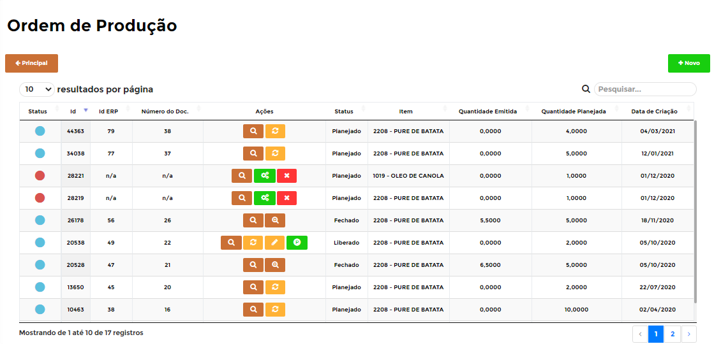

!!! Legenda

	=== "Status"
		**:fontawesome-solid-circle:{ .azul_status } - O Status da Ordem de produção foi atualizada**: Esse **Status** quer dizer que a **==Produção==** está aguardando para ser enviada à fila de integração com *SAP Business One*.

		**:fontawesome-solid-circle:{ .preto } - Aguardando integração**: Esse **Status** quer dizer que a **==Produção==** está na fila de integração com o *SAP Business One*.

		**:fontawesome-solid-circle:{ .vermelho } - Erro**: Esse **Status** quer dizer que o *SAP Business One* gerou algum erro, para saber qual é basta posicionar o cursor em cima do Status **Status**.

Para conseguir criar uma, basta clicar em **Novo** e na próxima tela é necessário informar os campos necessários

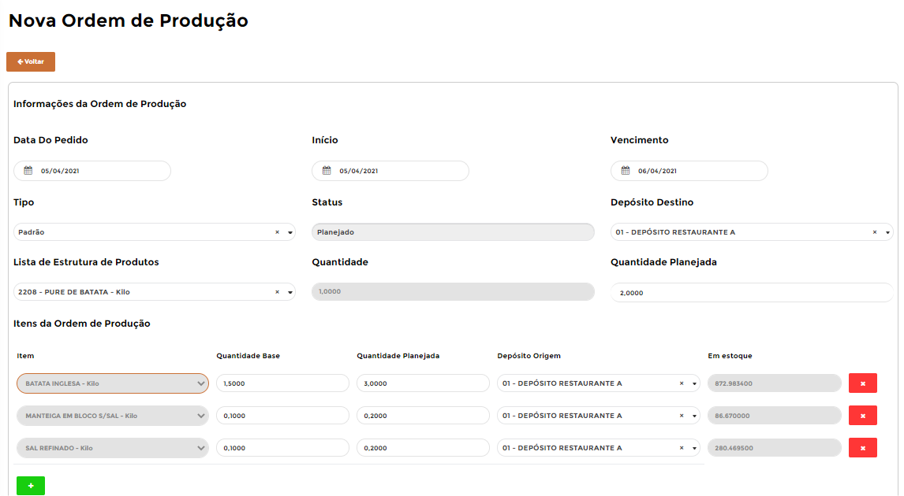

Segue as informações dos campos:

=== "Cabeçalho"

	*	**Data do Pedido**: Informar o fornecedor que está fazendo o Ordem de Produção
	*	**Início**: Informar o fornecedor que está fazendo o Ordem de Produção
	*	**Vencimento**: Informar o fornecedor que está fazendo o Ordem de Produção
	*	**Tipo**: Informar o fornecedor que está fazendo o Ordem de Produção
	*	**Status**: Informar a data que o fornecedor irá entregar os produtos
	*	**Depósito Destino**: Informar a data que o fornecedor irá entregar os produtos
	*	**Lista de Estrutura de Produtos**: Informar a data que o fornecedor irá entregar os produtos
	*	**Quantidade**: Informar a data que o fornecedor irá entregar os produtos
	*	**Quantidade Planejada**: Informar a data que o fornecedor irá entregar os produtos

=== "Linhas"

	*	**Item**: Informar o item que deseja pedir.
	*	**Quantidade Base**: Informar a quantidade necessária (lembrando da conversão de medida)
	*	**Quantidade Planejada**: Informar a quantidade necessária (lembrando da conversão de medida)
	*	**Depósito Origem**:
	*	**Em Estoque**: Se estiver com a configuração marcada, irá aparecer esse campo informando a quantidade desse item no estoque
	*	**Ação**: Excluir a linha

Para finalizar a **==Ordem de Produção==** é possível informar uma **Observação** para detalhar alguma informação e depois disso basta clicar em **Salvar**

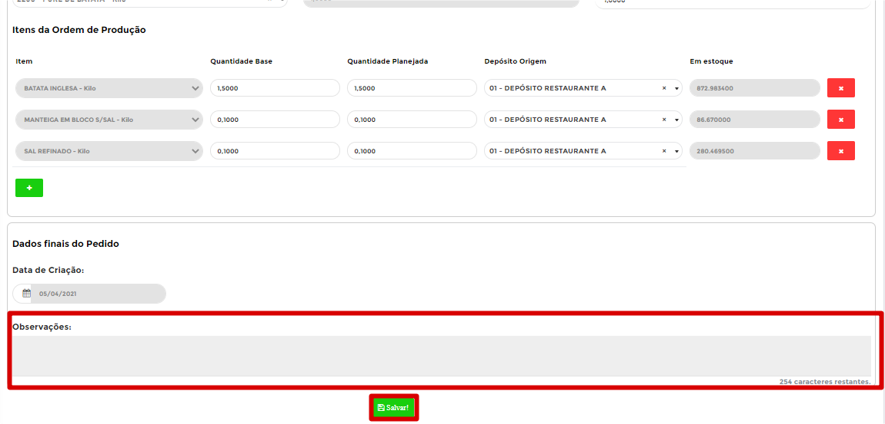

Pode acontecer de esquecer de preencher algum campo, com isso o B1Food irá apresentar uma **mensagem de erro**, segue exemplo

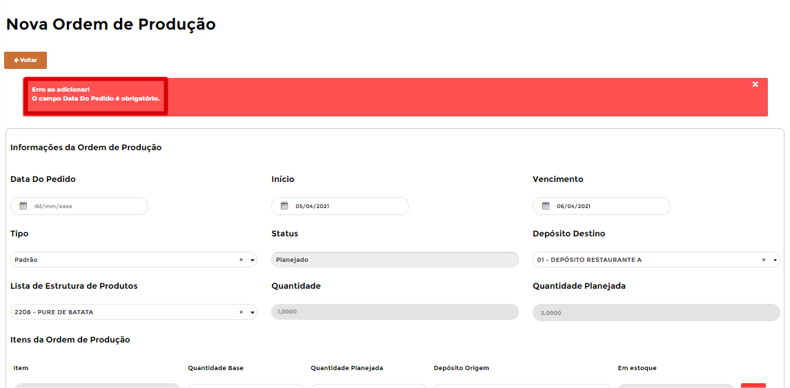

Caso o **==Ordem de Produção==** estiver certa irá aparecer uma mensagem de **Registro adicionado com sucesso** e será necessário clicar no botão **Voltar** para ir à página inicial do **==Ordem de Produção==**

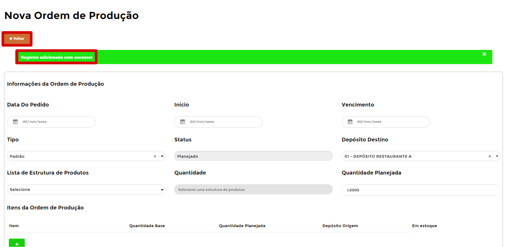

A **==Ordem de Produção==** que acabou de criar irá entrar na fila de integração com o *SAP Business One* automaticamente (:fontawesome-solid-circle:{ .preto }), pois antes de tudo é necessário criar esse documento.

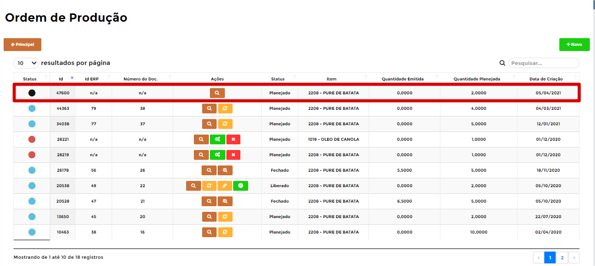

Após a criação da **==Ordem de Produção==**, será habilitado 2 ações para realizar com essa **==Ordem de Produção==**

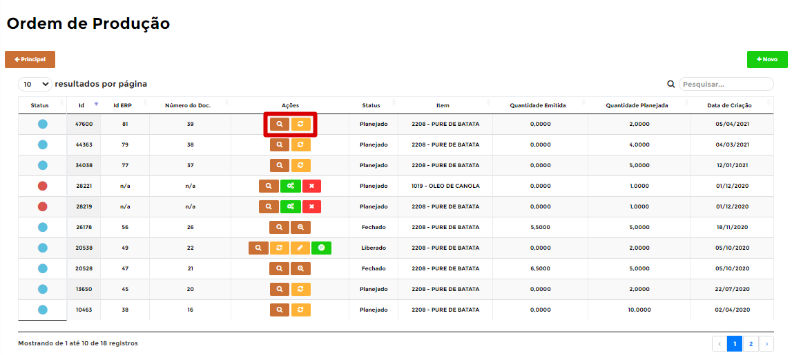

=== ":fontawesome-solid-search:{ .search }"
	*	A ação **Visualizar** irá abrir a **==Ordem de Produção==** para poder avaliar algum item, por exemplo. 

	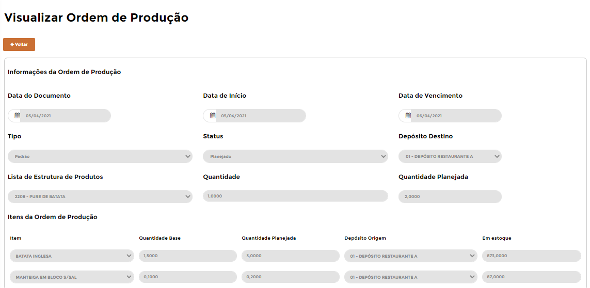{ align=left }

=== ":material-refresh:{ .pen }"
	*	A ação **Gerencir Status** irá abrir uma tela para realizar a troca desse **Status**, pois quando a **==Ordem de Produção==** é criada, é utilizado por padrão o Status **Planejada**, e para realizar qualquer movimentação nela, primeiro precisa mudar o **Status** para **Liberada** e depois realizar o **Lançamento de Produto acabado** é necessário mudar para **Fechado** o **Status**.

	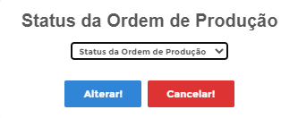{ align=left }

Após realizar a **Mudança de Status** a **==Ordem de Produção==** irá entrar na fila para integração automaticamente (:fontawesome-solid-circle:{ .preto })

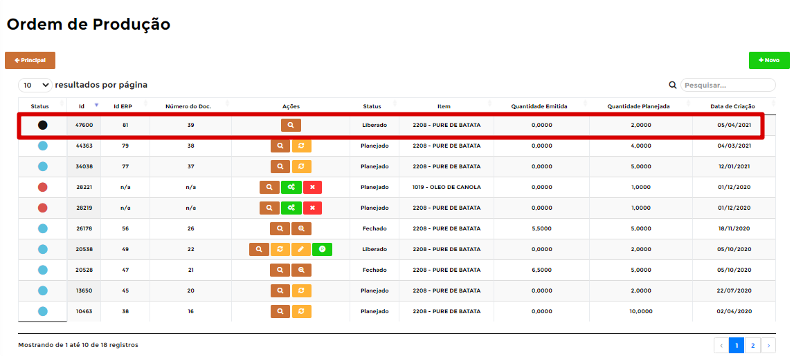

Com o Status **Liberado** da **==Ordem de Produção==**, o B1Food libera as seguintes ações

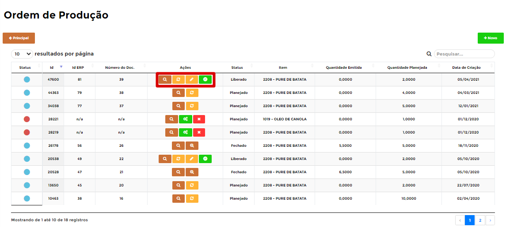

=== ":fontawesome-solid-search:{ .search }"
	*	A ação **Visualizar** irá abrir o **==Ordem de Produção==** para poder avaliar algum item, por exemplo. 
	{ align=left }

=== ":material-refresh:{ .pen }"
	*	A ação **Gerencir Status** irá abrir uma tela para realizar a troca desse **Status**, pois quando a **==Ordem de Produção==** é criada, é utilizado por padrão o Status **Planejada**, e para realizar qualquer movimentação nela, primeiro precisa mudar o **Status** para **Liberada** e depois realizar o **Lançamento de Produto acabado** é necessário mudar para **Fechado** o **Status**.
	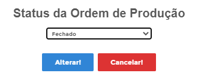{ align=left }

=== ":fontawesome-solid-pen-square:{ .pen }"
	*	A ação **Editar Ordem de Produção** irá abrir a **==Ordem de Produção==** para poder realizar alguma modificação (lembrando que não é tudo que o B1Food irá autorizar modificações)
	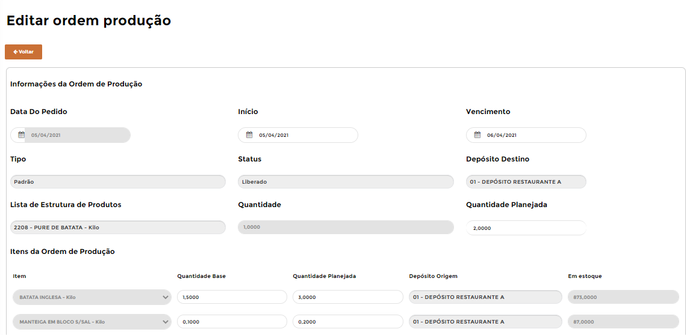{ align=left }

=== ":fontawesome-brands-product-hunt:{ .verde }"
	*	A ação **Lançar produto acabado** irá abrir uma tela para realizar a entrada do produto acabado, onde é necessário preencher alguns dados.
	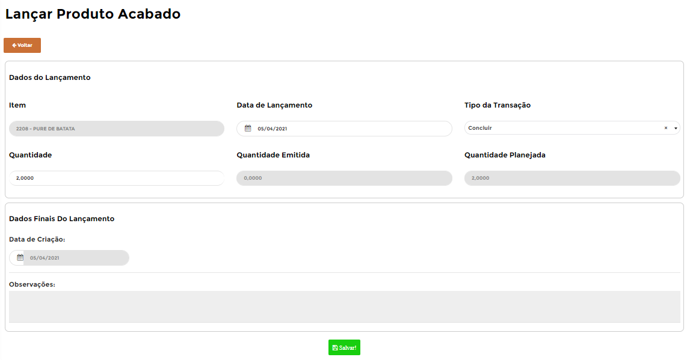{ align=left }
	Segue as informações dos campos:

	=== "Campos"

		*	**Data de Lançamento**: 
		*	**Tipo**: 
		*	**Quantidade**: 
		*	**Observações**: 

Quando realizar o **Lançar produto acabado** será habilitado um novo botão para realizar o acompanhamento dos **Lançamentos produtos acabados**

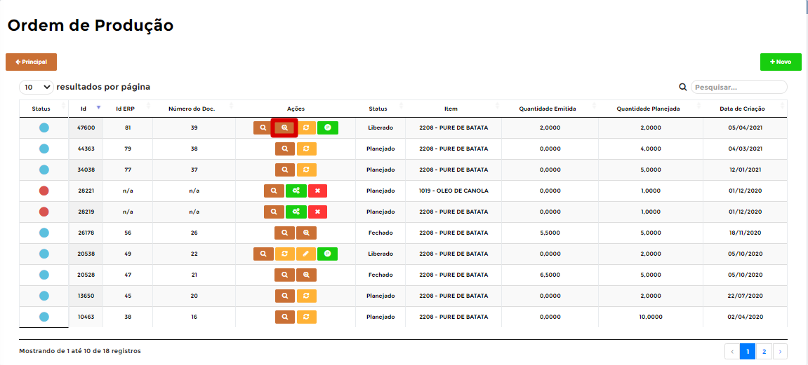

Ao clicar no botão, será listado todos os **Lançamentos produtos acabados** para essa **==Ordem de Produção==**, pois pode acontecer de ter mais de 1 entrada do produto acabado

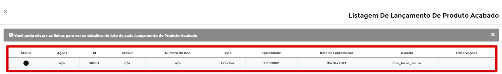

!!! warning "Processo"
		Após o Status estiver **Liberado**, primeiro é necessário realizar o **Lançamento de Produto acabado** e após ele estar integrado que pode realizar a mudança de Status para Fechado

Para finalizar o processo, quando realizar a mudança do **Status** para **Fechado**, essa é a última etapa desse módulo.

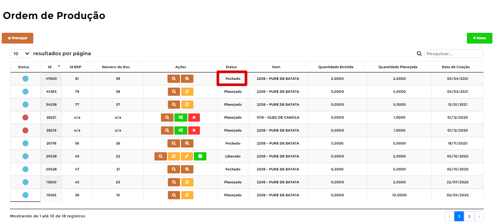
